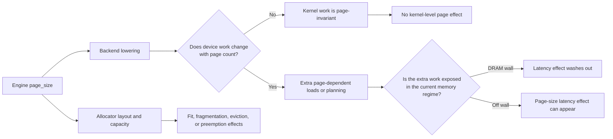
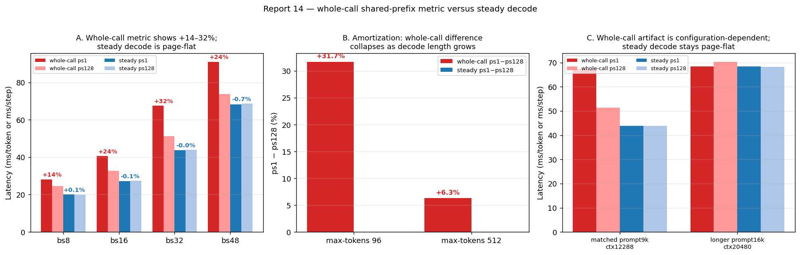
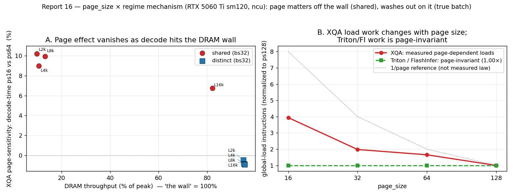

# When KV-cache page size actually matters in LLM decode

*A measurement-driven technical note on SGLang attention backends, memory regimes, and benchmark design*

KV-cache page size looks like a simple allocator knob. Smaller pages reduce internal fragmentation; larger
pages reduce the number of page descriptors and can make address generation more regular. It is tempting
to infer a universal performance rule from that trade-off.

The measurements in this repository point to a more useful conclusion:

> A page-size latency effect requires both **page-dependent work in the selected backend** and a
> **runtime regime in which that extra work is visible**.

If the backend lowers every engine page size to the same token-level device work, changing the allocator
knob cannot create an attention-kernel speedup by itself. If the backend is genuinely page-aware, smaller
pages can add work—but the added work may still disappear behind the DRAM-bandwidth wall. This distinction
explains why superficially similar experiments in FlashInfer, Triton, and XQA produced different outcomes.

## The four layers hidden behind one configuration flag

An engine-level `page_size` setting can affect several layers, and those layers should not be conflated:

1. **Capacity and allocation.** Page granularity changes internal fragmentation, pool capacity, and
   potentially whether a batch fits without eviction or preemption.
2. **Metadata and lowering.** The engine may translate logical pages into a per-page table, a per-token
   index list, or a backend-specific plan. The chosen representation determines whether page count changes
   the amount of work.
3. **Kernel execution.** A kernel may issue page-granular loads, consume token-flat indices, or hide the
   mapping behind a fused implementation.
4. **The active bottleneck.** Additional instructions matter only if latency is not already dominated by
   streaming KV or model bytes from DRAM, launch overhead, or another system component.



This model also separates two questions that benchmark reports often mix together:

- Does page size change the attention kernel's steady work?
- Does page size change end-to-end behavior through capacity, scheduling, or admission?

Both are legitimate systems questions, but they require different measurements.

## The measurement trap: whole-call TPOT was not steady decode

The original shared-prefix experiments appeared decisive. The historical harness reported Triton
`page_size=1` slowdowns of roughly 11–25%, and a long-context FlashInfer experiment reported paired
slowdowns of 8.2–9.2%. Those results were reproducible as whole-call numbers.

They were not, however, steady-decode kernel effects.

The same engine logs contain per-step decode timing. Re-analysis showed:

- the historical shared-prefix Triton cells were approximately page-flat at steady state
  (`ps1` versus `ps128`: −0.3%, −0.5%, −0.4%, and −1.2% across the recorded batches);
- the three paired FlashInfer runs were also page-flat at steady state
  (−0.7%, −0.2%, and −0.7%);
- a behaviorally matched reconstruction reproduced a +31% whole-call difference while measuring
  43.80 versus 43.83 ms for the steady decode step.

The old TPOT window began before the batch had reached stable shared-prefix decode. It therefore charged a
cold admission ramp to “decode.” The arithmetic was internally consistent, but the interval did not isolate
the quantity its label implied.



This is a broadly applicable benchmarking lesson: **a precise statistic can still answer the wrong
question**. For serving measurements, the timing boundaries are part of the experiment, not a formatting
detail.

## Why FlashInfer and Triton were flat in the tested SGLang paths

Source tracing and controlled microbenchmarks changed the mechanism hypothesis.

In the studied SGLang/FlashInfer build, normal decode constructs a per-token `kv_indices` list of length
`B × context`, independent of the engine page size, and plans the FlashInfer operation with device page
size 1. The allocator can change which token slots are used, but `ps1` does not create a 128-times-longer
decode index than `ps128`.

That source fact was tested rather than accepted on inspection alone:

- synthetic plan lengths from 64 to 2.1 million entries stayed near 0.26 ms;
- worst-case randomized token-index scatter changed the measured MHA/GQA kernel by only about 0.8–1.3%;
- profiler counters showed essentially identical DRAM traffic and memory-transaction efficiency for
  contiguous and scattered layouts in the tested cells.

The tested Triton engine path likewise performed page-independent steady work in the reconciled runs.
Once the whole-call admission artifact was removed, the original large “Triton page penalty” no longer
appeared in same-run per-step decode.

This does not prove that FlashInfer or Triton can never become page-sensitive. It establishes a narrower,
more defensible result: **these SGLang lowering paths did not convert the engine page-size knob into
different steady attention work in the measured configurations**.

## XQA is the positive control: the backend really is page-aware

The `trtllm_mha` path on the tested sm120 stack selected FlashInfer's XQA kernel. Unlike the reconciled
FlashInfer and Triton paths, XQA performed page-count-dependent device work.

Nsight Compute measured approximately 2.33–2.39 times as many global-load instructions at page 16 as at
page 64 in the headline shared-prefix cells. The relationship is not a pure `1/page` curve because the
kernel also contains fixed and page-independent instructions, but the page-count component is direct and
replayable.

The latency response depended on the memory regime:

| Regime | Hardware behavior | `ps16` versus `ps64` |
|---|---|---:|
| Shared physical KV, high L2 reuse, off the DRAM wall | Extra XQA load instructions are exposed | about +9–10% isolated kernel time |
| Distinct KV, approximately 95% of peak DRAM throughput | KV streaming dominates | approximately flat |
| Shared-prefix engine runs | Kernel effect is diluted by the rest of the decode step | monotone spread up to 4.8% |



This is the central technical result. “Off the DRAM wall” is not by itself a page-size mechanism; it is an
**exposure condition**. XQA shows a page effect off-wall because it first satisfies the other condition:
its load work genuinely changes with page count.

## A compact two-factor rule

The observations can be summarized by a conceptual model:

```text
observable page sensitivity
    ≈ backend page-dependent work
      × visibility of that work in the active bottleneck
```

This is not a predictive performance equation. It is a diagnostic decomposition.

- If page-dependent work is zero, moving off the DRAM wall does not manufacture an effect.
- If page-dependent work is nonzero but DRAM streaming dominates, the effect can wash out.
- If page-dependent work is nonzero and the kernel is off-wall, latency can track page size.
- Separately, allocation granularity can affect capacity and scheduling even when kernel time is flat.

The last point explains the vLLM cross-check. Apparent 6–21% block-size changes occurred when the requested
batch exceeded the KV pool and vLLM wave-scheduled or preempted requests. Clean cells that fit the pool were
flat to roughly 0.2%. That was a real system response to block-dependent capacity, but not evidence of a
steady attention-kernel penalty.

## How to investigate a page-size result rigorously

A useful workflow is to resolve the layers in order.

### 1. Verify that the compared workload actually fits

Record the KV-pool capacity, requested `batch × (context + generation)`, maximum concurrency, eviction, and
preemption. An experiment that silently changes scheduling is no longer a controlled kernel comparison.

### 2. Define the timing interval

Distinguish:

- time to first token;
- cold admission or prefix-cache population;
- per-step steady decode;
- whole-request latency;
- throughput under load.

For kernel claims, use engine per-step lines or an isolated kernel timer. Whole-call TPOT is insufficient
unless its boundaries are proven to enclose only steady decode.

### 3. Trace the backend selected at runtime

An engine flag does not reveal the executed kernel. Confirm:

- backend dispatch and kernel identity;
- accepted page sizes;
- whether the index representation is per-page or per-token;
- whether planning happens once, per graph capture, or per step;
- whether page size changes instruction count, index values, or only allocation.

### 4. Measure the bottleneck rather than infer it from tensor size

Useful counters include:

- DRAM throughput and bytes;
- L2 hit rate and hit/miss sector counts;
- global-load instruction count;
- long-scoreboard stalls;
- achieved occupancy, grid size, and waves per SM;
- kernel duration with controlled cache state.

A small footprint does not automatically imply an L2-served kernel. Reuse and residency are different:
data can fit in cache yet miss on its first and only touch.

### 5. Use paired and replayed controls

Measure page sizes close together in time, reverse their order, repeat the decisive cells, and re-profile a
headline counter. Compare same-run per-step values whenever possible. Cross-launch averages are vulnerable
to clock state, contention, JIT, and admission differences.

### 6. State the evidence boundary

Negative results should be scoped to the backend, lowering path, GPU, software version, and tested shapes.
Missing raw runs and single-round cells should remain explicit. A strong technical artifact makes its
limits easy to locate.

## Practical implications for serving systems

For practitioners, page size should not be tuned from a universal “small is faster” or “large is faster”
rule.

- Choose smaller pages when reducing internal fragmentation or increasing effective KV-pool capacity is
  the dominant concern.
- Consider larger pages when the selected kernel performs measurable page-count-dependent work and the
  workload operates off the bandwidth wall.
- Treat sudden latency changes near the pool limit as possible scheduling or preemption transitions before
  attributing them to the attention kernel.
- Re-evaluate the result after backend, model shape, CUDA graph mode, GPU architecture, or library version
  changes; these can change the lowering path itself.

The most transferable insight is methodological: **configuration knobs do not have performance effects in
the abstract**. Their effects are mediated by lowering, kernel work, and the active hardware bottleneck.
Understanding those transformations is more reliable than extrapolating from the name of the knob.

## Evidence trail

- [Study synthesis and report index](studies/kv-cache-page-size/README.md)
- [Data manifest and provenance limits](studies/kv-cache-page-size/DATA_MANIFEST.md)
- [Report 10: FlashInfer page-independent lowering and scatter bound](studies/kv-cache-page-size/reports/10-flashinfer-page-cost/report.md)
- [Report 12: L2 reuse versus residency](studies/kv-cache-page-size/reports/12-reuse-not-residency/report.md)
- [Report 14: whole-call benchmark artifact](studies/kv-cache-page-size/reports/14-shared-prefix-benchmark-artifact/report.md)
- [Report 15: original-log forensics](studies/kv-cache-page-size/reports/15-log-forensics-and-upper-bound/report.md)
- [Report 16: XQA page-aware mechanism](studies/kv-cache-page-size/reports/16-trtllm-mha-xqa/report.md)
