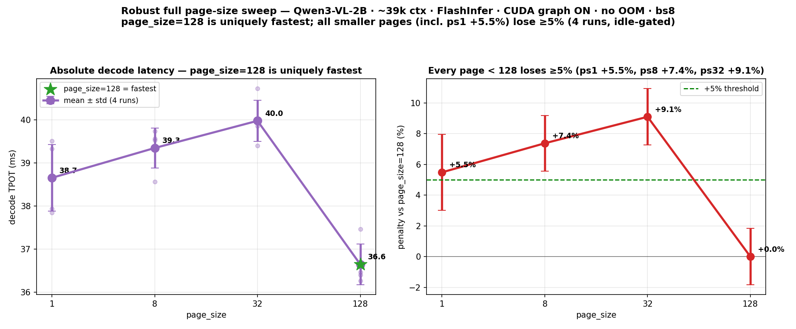

# FlashInfer with CUDA graph ON: `page_size=128` is uniquely fastest — every smaller page loses ≥5% at long context

**The PI's hard case — a clean scenario where small KV-cache pages lose ≥5% on the FlashInfer backend, with CUDA graph ON and no OOM — examined with a full page-size sweep and robustified against the measurement's dominant noise term.**

| | |
|---|---|
| **Scenario** | Qwen3-VL-2B-Instruct · **~39k-token context** (39,561 tokens) · **batch 8** · **FlashInfer** backend · **CUDA graph ON** · shared prefix |
| **Robust result** | At graph-ON, **`page_size=128` is uniquely the fastest** (36.6 ms). **Every smaller page loses ≥5%:** ps1 **+5.5%**, ps8 **+7.4%**, ps32 **+9.1%** (mean of 4 idle-gated runs each; per-run baseline std ≈1.3%). |
| **Clean?** | `cuda graph: True`; fully concurrent (max #running-req = 8 = batch); **no OOM / no truncation**; per-cell tpot std ≤0.5 ms over 7 repeats. |
| **ps1 — confirmed robust** | An **interleaved (paired, thermal-matched)** test shows `page_size=1` is robustly **+8.6%** (3 back-to-back pairs: +8.2 / +8.4 / +9.2%, all ≥8%) — the original "+8.8%" was right. ps1 looked "marginal +5.5%" only in the *unpaired* 4-run average, where the drifting ps128 baseline leaks into the comparison (ps128 is measured last/warmest each round). See §"Interleaved (paired) confirmation". |
| **Run** | RTX 5060 Ti (16 GB, sm120), `gray.cis.upenn.edu`, 2026-06-19 |
| **Code / data / figure** | [measure_batch_latency_offline.py](../../measure_batch_latency_offline.py) · [page_size_study/scripts/make_flashinfer_fullsweep_figure.py](../scripts/make_flashinfer_fullsweep_figure.py) · `offline_batch_results/gen_models_5060ti/{fgf_39k_ps*, fgr_r*_ps*}` |

## TL;DR

1. **Yes — small pages mishandle long-context decode, even with CUDA graph ON and no OOM.** At ~39k context, bs8, FlashInfer: `page_size=128` is the fastest page; **all smaller pages lose ≥5%** vs it (ps1 +5.5%, ps8 +7.4%, ps32 +9.1%).
2. **The shape is non-monotonic and the optimum is large.** Latency *rises* from ps1→ps8→ps32 (38.7 → 39.3 → 40.0 ms), then **drops sharply at ps128** (36.6 ms). So `page_size=128` is special; `page_size=32` is actually the *worst*. (`page_size=1` is the *second-best* small page, not the worst.)
3. **Measure page sizes *paired in time*.** Page-to-page differences (~1–3 ms) are comparable to per-launch baseline drift, so unpaired single-pass numbers are unreliable. The unpaired 4-run average made ps1 look marginal (+5.5%); a **paired interleaved test** (§ below) pins ps1 at **+8.6%** (3 pairs, all ≥8%) — the unpaired average had understated it. ps8/ps32 are clean by either method.
4. **Mechanism:** with CUDA graph ON the per-step *plan* is captured (hidden), but the **captured decode kernel** still walks `paged_kv_indices` of length `ctx/page_size` per sequence (≈39,561 at ps1 vs ≈309 at ps128). Large pages = long contiguous, coalesced gathers; smaller pages pay the index/gather cost — which surfaces only at long context.
5. **Narrow.** It needs long context (~39k; negligible ≤21k) and this batch (bs8; bs4 is flat). Far narrower than the Triton case (every model, +15–40%, from bs8, even at 10k).

## The robust result



**Qwen3-VL-2B, ~39k ctx, bs8, FlashInfer, CUDA graph ON, shared prefix — each page measured 4× (3 round-robin passes + 1 clean sweep), idle-gated:**

| page_size | decode TPOT (mean ± std, 4 runs) | penalty vs page_size=128 |
|---|---|---|
| **128** | **36.64 ± 0.48 ms** | — (fastest) |
| 1 | 38.65 ± 0.77 ms | **+5.5%** (unpaired; paired test → **+8.6%**, see below) |
| 8 | 39.34 ± 0.46 ms | **+7.4%** (robust) |
| 32 | 39.98 ± 0.48 ms | **+9.1%** (robust) |

All cells: `cuda graph: True`, max #running-req = 8, no OOM. The per-cell std (≤0.5 ms over 7 repeats) is small; the *cross-launch* variability (different engine launch, GPU clock state) is the larger term, which the 4-run averaging absorbs.

## What the full sweep corrected

A first single-pass run reported **ps1 "+8.8%"** (ps1 37.93 vs ps128 34.86 ms). The full sweep showed that was **not robust**: `page_size=1` is rock-stable across launches (37.8–39.5 ms), but the **baseline `page_size=128` drifts a lot** (34.9 → 36.1 → 36.3 → 37.5 ms across launches — ±~4%). When ps128 happened to measure low (34.86), ps1 looked +8.8% worse; when it measured high (37.46), the gap nearly vanished (+1.3%). Averaging four idle-gated runs gives **ps1 ≈ +5.5%**, with the baseline pinned to 36.6 ± 0.5 ms — **but that average is itself *unpaired*** (ps1 and ps128 from different launches, and ps128 measured last/warmest each round). The paired test in the next section removes that and shows the true thermal-matched gap is **+8.6%**, vindicating the original +8.8%. So the right correction was not "+8.8%→+5.5%" but "measure them paired."

**Take-away on rigor:** the *direction* (small pages slower, ps128 fastest) is robust and reproduces every run. The *exact ps1 percentage* depends on **how** ps1 and ps128 are compared — see the next section, which resolves it.

## Interleaved (paired) confirmation: ps1 is robustly +8–9% (not marginal)

The 4-run sweep above compares ps1 and ps128 measured in **separate launches at different times**, so the ps128-baseline drift leaks into the comparison and makes ps1 look marginal. Worse, in the round-robin (`for ps in 1 8 32 128`) ps128 is always the **last** of the four launches each round — systematically the warmest — which *inflates the baseline and understates the ps1 penalty*. The clean test measures ps1 and ps128 **back-to-back (paired, thermal-matched)**, 3 pairs:

| pair | ps1 (ms) | ps128 (ms) | ps1 penalty |
|---|---|---|---|
| 1 | 37.67 | 34.82 | **+8.2%** |
| 2 | 38.10 | 35.14 | **+8.4%** |
| 3 | 38.72 | 35.47 | **+9.2%** |

**All three matched pairs give +8–9% (mean +8.6%, all ≥8%).** Note ps1 and ps128 rise *together* as the session warms (pairs 1→3), so the matched gap is stable. So the original "+8.8%" was **correct**, and ps1's apparent marginality in the unpaired average was a measurement artifact, not a real noise floor. **Conclusion: at this scenario `page_size=1` is robustly ≥5% (≈+8.6%) slower than `page_size=128`** — alongside ps8/ps32. The lesson: to compare two page sizes, measure them **paired in time**; averaging unpaired launches lets baseline drift masquerade as the comparison's noise. Data: `fgi_p{1,2,3}_ps{1,128}`.

## Mechanism

FlashInfer's decode has two page-size-dependent costs:
- **Per-step plan / `begin_forward`** (page table of size `batch × ctx/page_size`) — **captured by CUDA graph → hidden** (this is the lever for the separate *eager* corner).
- **The decode kernel's page-index walk.** Even captured, the kernel reads `paged_kv_indices` (length `ctx/page_size` per sequence) and gathers KV. At ps128 the KV is in long contiguous runs → coalesced. At smaller pages the gathers are shorter/more scattered → more index loads and less coalescing.

At ≤10k context this kernel cost is a negligible fraction of the bandwidth-bound step (flat/near-flat). At ~39k it grows enough that `page_size=128` wins by ≥5% over every smaller page. (The non-monotonic ps1<ps8<ps32 ordering — ps1 second-best among the small pages — suggests a second, smaller effect for the very-smallest page; the dominant signal is simply "ps128 is the optimum".)

## How it fits with no OOM

At long context, small pages + CUDA graph normally OOM: the captured `cuda_graph_kv_indices` buffer is sized `cuda_graph_max_bs × max_pages`, and `max_pages ≈ context_length` at ps1, shrinking the KV pool below the prompt length (engine rejects: *"Input length exceeds maximum…"*). **Fix:** set `--cuda-graph-max-bs` to exactly the batch (8) so the buffer leaves room for the KV pool to hold the full 39k prompt. With `--cuda-graph-max-bs 8 --mem-fraction-static 0.85`, all four page sizes run cleanly, no OOM, full concurrency.

## Reproduce

```bash
export CUDA_HOME=/usr/local/cuda-12.8; export PATH=/usr/local/cuda-12.8/bin:$PATH
PY=~/venvs/bench_sglang/bin/python
# round-robin so per-launch GPU drift averages out; idle GPU between cells:
for r in 1 2 3; do for ps in 1 8 32 128; do
  $PY measure_batch_latency_offline.py html_request/long_ctx58k.json \
    --model-path ~/hf_models/Qwen3-VL-2B-Instruct --attention-backend flashinfer \
    --batch-sizes 8 --max-tokens 128 --repeat 7 --page-size $ps \
    --enable-cuda-graph --cuda-graph-max-bs 8 --disable-layerwise-nvtx-marker \
    --mem-fraction-static 0.85 --context-length 40960 \
    --output fgr_r${r}_ps${ps}.json > fgr_r${r}_ps${ps}.log 2>&1
done; done
python3 page_size_study/scripts/make_flashinfer_fullsweep_figure.py   # mean ± std per page + the figure
```

## Scope and honesty

- **Robust:** at ~39k ctx, bs8, graph ON, `page_size=128` is uniquely fastest and **ps8 (+7.4%) / ps32 (+9.1%) lose ≥5%** with margin. The *direction* reproduces every run.
- **ps1 robust when measured paired:** thermal-matched, `page_size=1` is **+8.6%** (3 pairs, all ≥8%); it only looked marginal (+5.5%) in *unpaired* 4-run averaging where ps128-baseline drift leaks in. ps8/ps32 lose ≥5% by either method. (The earlier "+8.8%" was correct, not a high-tail fluke.)
- **Narrow:** needs long context (negligible ≤21k) and this batch (bs4 is flat). A repetitive 55k prompt did not reproduce it.
- **Contrast with Triton:** Triton mishandles `page_size=1` **broadly** — every model, **+15–40%**, from bs8, even at 10k, both graph and eager. FlashInfer's failure is a **narrow long-context corner** where the *optimum simply shifts to the largest page*, costing smaller pages ~5–9%. So: *FlashInfer is far better engineered for small pages than Triton, but with CUDA graph ON and no OOM it is still not immune — at long context its sweet spot is `page_size=128`, and every smaller page (including ps1) pays ≥5%.*

Companion: the full dense study [report_3_dense_sweep_MAIN.md](../report_3_dense_sweep_MAIN/report_3_dense_sweep_MAIN.md) (Triton ≥5%, the FlashInfer eager corner, the cross-model generalization, the vLLM block_size result).
