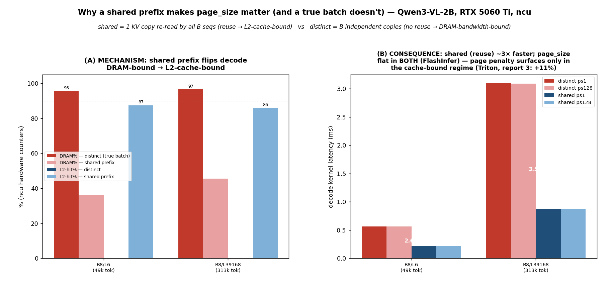

# Report 7 — WHY a shared prefix makes `page_size` matter (and a true batch doesn't): an ncu root-cause

> PI ask (relayed by Chuyue): *"profiling 看下能不能找到是什么导致了有和没有 shared prefix 的差距"* — find, with
> profiling, **what causes the gap** between the shared-prefix regime (where `page_size=1` loses ≥5%, reports
> 3 & 4) and the true-batch regime (where it doesn't, report 5). This report answers it with **ncu hardware
> counters**: a shared prefix turns decode from **DRAM-bandwidth-bound** into **L2-cache-bound**, and the page
> access pattern only costs latency in the cache-bound regime.

| | |
|---|---|
| **Question** | Why does `ps1` lose with a shared prefix but not in a true batch? |
| **Method** | Controlled microbench (`bench_xqa.py --kv-mode {shared,distinct}`): the *only* variable is whether the B sequences re-read **one** physical KV copy (shared) or **B independent** copies (distinct). ncu hardware counters + CUDA-event latency. |
| **Model / HW** | Qwen3-VL-2B (GQA-8, 4096 B/token/layer) · RTX 5060 Ti (16 GB, sm120, **L2 = 32 MB**) · **phastform** (ncu 2025.3.1 as root) |
| **Headline** | **shared → L2-cache-bound** (L2-hit ~86–94 %, DRAM ≪ peak); **distinct → DRAM-bandwidth-bound** (~95 % of peak DRAM, L2-hit ~0 %). The page pattern is hidden behind the bandwidth wall in a true batch and only surfaces when the KV is cache-resident (shared). |
| **Figure / data** | [fig_sharedprefix.png](fig_sharedprefix.png) · `offline_batch_results/sharedprefix_profile/` (ncu `.csv`, `lat_*.json`) · [SUDO_CHANGES.md](SUDO_CHANGES.md) |

## Is the message to the PI correct? (evaluation)
Both claims Chuyue sent are **correct**:
1. *"用 benchonebatch 跑，没有 shared prefix，ps1 没有展现出显著劣势"* — yes: report 5 + the adversarial search +
   the audit show `ps1` is fastest-or-tied within a ~1 % noise floor (paired 95 % CIs −0.3 % … −1.1 %; never ≥5 %).
2. *"benchonebatch 注定了 bs × contextlength 的权衡，两个相乘"* — yes: a true batch stores **B independent** KV
   copies, so total KV = B×L distinct tokens (~49 k cap on 16 GB). Confirmed live here: the engine **cannot** run
   distinct bs8×10k (77 k tokens → OOM); only a weightless microbench can reach distinct bs8×39k (313 k tokens).
The *causal* "because no shared prefix" is what this report proves by toggling only that variable.

## The mechanism (ncu) — the root cause
Decode attention does the same FLOPs in both modes; what differs is **memory traffic**. With a shared prefix
all B sequences read the **same** physical KV each step → high **reuse** → the bytes come from L2, not HBM.
With distinct KV there is no reuse → B× the bytes must stream from HBM.

| cell | mode | **DRAM % peak** | **L2 hit %** | SM % | bound by |
|---|---|---:|---:|---:|---|
| B8 / L6144 | distinct | **95.5** | **0.1** | 19 | **DRAM bandwidth** |
| B8 / L6144 | **shared** | **36.5** | **87.5** | 67 | **L2 cache (reuse)** |
| B16 / L3072 | distinct | 95.5 | 0.1 | 19 | DRAM bandwidth |
| B16 / L3072 | **shared** | **16.9** | **93.6** | 61 | L2 cache (reuse) |
| B8 / L39168 | distinct | 96.6 | 0.0 | 19 | DRAM bandwidth |
| B8 / L39168 | **shared** | **45.6** | **86.1** | 69 | L2 cache (reuse) |

**This is the gap.** A true batch is pinned at ~95 % of peak DRAM with ~0 % L2 reuse — memory-bandwidth-bound,
SMs ~80 % idle waiting on HBM. A shared prefix collapses DRAM to 17–46 % and lifts L2-hit to ~90 %: the same
KV, re-read by 8–16 sequences, lives in the 32 MB L2. (Note B16/L3072 shared = 12 MB/layer fits L2 outright;
B8/L39168 shared = 160 MB/layer exceeds L2 yet still hits 86 % — the **reuse within a step**, not raw residency,
is what cache-serves it.)

> **Why is distinct L2-hit ≈ 0 %? → [report 12](../report_12_reuse_not_residency/report_12_reuse_not_residency.md)** (the PI's follow-up). It's **reuse, not residency**: L2-hit ≈ **(R−1)/R** where R = each KV byte's intra-kernel reuse factor. Distinct decode = **R=1** (each KV byte read exactly once; GQA's 2× is absorbed in SMEM) → ≈0 % **even when the footprint is sub-L2**. Report 12 proves it with a reuse sweep at *pinned* 4 MB footprint (2.6→97 % along (R−1)/R), a (B,L) grid (distinct ≤2 % everywhere), a cold-vs-warm contrast (warm "hits" = a cross-launch residency artifact), and raw sector counts (distinct misses are 99.4–99.8 % compulsory). The shared 86–94 % here is the (R−1)/R curve at R=8/16.

**What exactly bounds each regime (Speed-of-Light breakdown, ps128):**

| cell | mode | DRAM % | L2-BW % | L1-BW % | SM % | L2 hit % | **bottleneck** |
|---|---|---:|---:|---:|---:|---:|---|
| B8/L6144 | distinct | **95.6** | 38 | 19 | 19 | 0.1 | **HBM/DRAM bandwidth** |
| B8/L6144 | shared | 36 | 61 | **66** | **66** | 87 | **on-chip: L1/L2 BW + SM** |
| B8/L39168 | distinct | **96.7** | 39 | 19 | 19 | 0.0 | **HBM/DRAM bandwidth** |
| B8/L39168 | shared | 46 | 67 | **69** | **69** | 86 | **on-chip: L1/L2 BW + SM** |

Distinct = **HBM-bandwidth-bound** (DRAM 96–97 % of peak; L2/L1/SM idle at ~19–39 %). Shared is **not**
HBM-bound (DRAM 36–46 %): the binding resources move on-chip — L1/L2 cache read bandwidth and SM throughput
(~61–69 %), fed by the ~87 % L2 hit from cross-batch reuse — none fully saturated, so it is a balanced
cache-bandwidth/compute regime, ~3× faster (L1/L2 BW ≫ HBM BW). **Page_size only matters in the shared
(on-chip-bound) regime**, where gather efficiency (coalescing / sectors / how well L1-L2 bandwidth is used)
is first-order; in the HBM-bound true batch you pay full bandwidth regardless of access pattern. (Data:
`sharedprefix_profile/sol/`.)

## The consequence (latency) — why the page penalty appears only when shared


- **Shared is ~3× faster** purely from the traffic difference: B8/L6144 0.21 ms vs 0.56 ms (2.6×); B8/L39168
  0.88 ms vs 3.10 ms (3.5×). Decode cost ≈ KV bytes moved from HBM, and shared moves B× fewer.
- **In the DRAM-bound (distinct) regime the page pattern is ~invisible.** For the FlashInfer kernel measured
  here, `ps1` vs `ps128` is flat to <0.5 % in every distinct cell — the kernel is waiting on HBM bandwidth, so
  how the index is walked barely changes the wall-clock; report 5 confirms `ps1` −0.3 … −1.1 % in the true
  batch for **both** backends at ≥6 k. (Triton keeps a *small* residual gather cost at very short distinct
  contexts — ~3–5 % at 3 k, report 3 §C.4, and ~+7 % bs16/3k in the eager engine cross-check here — but
  nothing like the cache-bound amplification below.)
- **In the cache-bound (shared) regime the page pattern is exposed.** Once decode is no longer bandwidth-bound,
  the per-page access cost (index walk / gather coalescing) becomes a first-order term. On **Triton**, whose
  `_fwd_kernel` gathers via a per-token indirect index, `ps1`'s scattered gather then costs **+11–25 %**
  (report 3, shared prefix). FlashInfer's fused paged kernel is page-robust even when cache-bound (here `ps1`
  ≈ `ps128` to <0.5 % in shared mode too), so its small shared-prefix `ps1` cost (report 4, +8.6 % at 39 k under
  CUDA graph) is an **engine/graph-level** effect (per-step `begin_forward` page-table build), not this kernel.

So the unifying root cause: **shared prefix → KV reuse across the batch → decode shifts from
DRAM-bandwidth-bound to L2-cache-bound → the page access pattern stops being hidden → small pages can lose.**
Remove the shared prefix (true batch) → DRAM-bound → page is free.

## Is the ~1% true-batch `ps1` "lead" a real advantage? — No (ncu over-read test)
Report 5's true-batch `ps1` is −0.3…−1.1 % vs the best page. Is that a genuine `ps1` advantage (e.g. `ps128`
over-reads its partial last page) or just the hidden-disadvantage wash? **Instrumented answer: a wash.** In the
DRAM-bound (distinct) regime, ncu `dram__bytes_op_read.sum` for `ps128` ÷ `ps1` = **0.998–0.999** at *every*
context — whether the last page is full (L=1024, 6144) or 1/128 or 64/128 full (L=1025, 1088, 6080). So:
- **`ps128` does NOT over-read the partial last page** (FlashInfer honours `kv_last_page_len`); the "padding
  over-read → `ps1` wins" hypothesis is **refuted**.
- If anything `ps1` reads **marginally more** bytes (its index is 128× larger: B×L vs B×L/128 entries) — at the
  byte level `ps1` is slightly *worse*, not better.
- Clean single-kernel latency is **tied to ±0.8 %** with no systematic exact-vs-partial-page pattern
  (inconsistent sign across L).

So in a true batch `ps1` is **genuinely tied** with large pages — its index/gather disadvantage is hidden by
the bandwidth wall, leaving no net winner. The ≤1 % "lead" in the engine (`bobs`) is at the noise / engine-
metadata floor, **not** a real `ps1` kernel advantage. (Data: `sharedprefix_profile/pad2/`.)

## Method / controls
- **Single controlled variable.** `build_flashinfer(..., kv_mode)` in `bench_xqa.py`: `distinct` allocates
  `B×ppr` pages with `kv_indices = arange`; `shared` allocates `ppr` pages and points every sequence's index
  range at them (`arange(ppr).repeat(B)`). Identical q, dims, dtype, page_size — only KV duplication differs.
- **ncu**: `--profile-from-start off` + `--single` (one launch wrapped in `cudaProfilerStart/Stop`); metrics
  `dram__throughput.avg.pct_of_peak_sustained_elapsed`, `lts__t_sector_hit_rate.pct`, `l1tex__t_sector_hit_rate.pct`,
  `sm__throughput…`, `gpu__time_duration.sum`. Run as root (RmProfilingAdminOnly=1); see SUDO_CHANGES.md.
- **Weightless microbench advantage:** no model weights → distinct bs8×39k (~1.3 GB KV) fits, so the exact
  penalty regime is reachable in *both* modes — impossible in the engine (the bs×ctx tradeoff).

## Caveats / honesty
- The microbench reproduces the **first-order** mechanism (the DRAM↔cache flip) and the **3× shared speedup**
  cleanly, but FlashInfer's *kernel* shows no `ps1` page penalty even in shared mode — consistent with report 4
  attributing FlashInfer's small +8.6 % to the engine's per-step plan under CUDA graph, not the decode kernel.
  The large, robust page penalty is **Triton's** (report 3), a kernel property that lives in the cache-bound
  (shared) regime — which this report explains.
- Engine cross-check (gray, radix ON vs `--disable-radix-cache`, eager) confirmed the radix control works
  (shared shows `#cached-token>0`, distinct `=0`); strong-signal 10 k cells OOM'd (the bs×ctx tradeoff) and the
  3 k cells were low-signal/noisy, so the **ncu microbench is the primary evidence**; the Triton page penalty
  itself is already established in reports 3 & 5.
- Counters are RTX 5060 Ti (sm120); absolute DRAM % is hardware-specific, but the shared-vs-distinct *flip* is
  the architecture-independent point.

## Reproduce
```bash
# phastform (full bench_sglang venv: torch cu128 + sglang dev + flashinfer 0.6.6; CUDA_HOME=/usr/local/cuda-12.8)
export PATH=~/venvs/bench_sglang/bin:/usr/local/cuda-12.8/bin:$PATH
# latency (no profiler):
python bench_xqa.py --latency --backends flashinfer --kv-mode shared   --page-sizes 1 128 --batch-sizes 8 --seq-lens 6144 39168
python bench_xqa.py --latency --backends flashinfer --kv-mode distinct --page-sizes 1 128 --batch-sizes 8 --seq-lens 6144 39168
# ncu counters (root):
sudo -E bash page_size_study/scripts/profile_sharedprefix_ncu.sh
# locally:
python3 page_size_study/scripts/make_sharedprefix_figure.py     # fig_sharedprefix.png
```

Companion reports: [report_3](../report_3_dense_sweep_MAIN/report_3_dense_sweep_MAIN.md) (Triton shared-prefix
`ps1` +11–25 %), [report_4](../report_4_flashinfer_graph_case/report_4_flashinfer_graph_case.md) (FlashInfer
shared +8.6 %), [report_5](../report_5_bench_one_batch/report_5_bench_one_batch.md) (true batch: no penalty).
