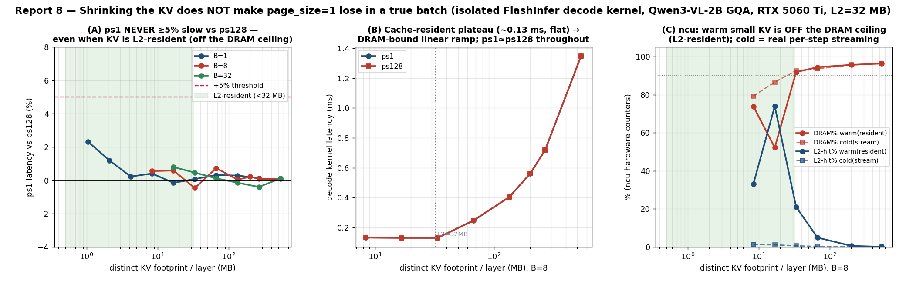

# Report 8 — Does `page_size=1` lose its tie when the KV-cache is *small*? (true batch, off the DRAM wall)

> PI ask (relayed by Chuyue, 2026-06-25): *"我们已经知道瓶颈是带宽，是因为 KV 太多。用更小的 KV 再跑一次
> bench_one_batch（让它不到 DRAM 带宽瓶颈），完整、严谨地重跑，用图展示这种情况下 ps1 和其它 page 的延迟。"*
> Reports 5 & 7 showed a true batch is **DRAM-bandwidth-bound**, which is *why* `page_size=1` ties `ps128`
> (the access pattern is hidden behind the bandwidth wall). The natural test: **shrink the KV so decode is no
> longer DRAM-bound — does `ps1` finally lose?**

| | |
|---|---|
| **Question** | In a true batch (no shared prefix), does a **small** KV (off the DRAM-bandwidth ceiling) make `ps1` ≥5 % slower? |
| **Answer** | **No.** You cannot leave the DRAM regime in a true batch by shrinking KV (the weights, then the cold per-step KV stream, keep it DRAM-bound); and in the *one* regime where small KV *does* become cache-resident, `ps1` still ties `ps128`. No ≥5 % `ps1` penalty anywhere. |
| **Tiers** | **A** engine `bench_one_batch` TPOT (gray) · **B** isolated FlashInfer decode kernel + **ncu** footprint sweep (phastform, root) |
| **Model / HW** | Qwen3-VL-2B-Instruct (GQA, weights **4.10 GB**, KV **114688 B/token** = 28×4096) · RTX 5060 Ti (16 GB, sm120, **L2 = 32 MB**) |
| **Regime** | **TRUE batch** — B independent sequences, **no shared prefix / radix**; CUDA graph ON (engine) |
| **Backends** | FlashInfer (primary; page-agnostic, supports `ps1`), XQA (page ≥16), Triton (engine only) |
| **Metric** | engine decode **TPOT = `median_decode_latency`×1000** ms · kernel **CUDA-event median** (100 iters) · **ncu** counters |
| **Data** | `offline_batch_results/bench_one_batch_smallkv_5060ti/bobk_*.jsonl` · `offline_batch_results/smallkv_profile/` (`lat_distinct_*.json`, ncu `*.csv`) |
| **Figures** | [fig_smallkv_kernel.png](fig_smallkv_kernel.png) (headline: kernel + ncu) · [fig_smallkv_engine.png](fig_smallkv_engine.png) (engine TPOT + roofline) · [SUDO_CHANGES.md](SUDO_CHANGES.md) |

---

## Headline

**Shrinking the KV does *not* make `page_size=1` lose in a true batch.** Across the full footprint ladder
(1 MB → 537 MB per layer, spanning deeply L2-resident → DRAM-saturating) the isolated FlashInfer decode
kernel shows `ps1` vs `ps128` **flat to ≤ +0.8 %** (B8/B32) — the largest deviation is **+2.3 %** at the tiniest
cell (B1/L256, sub-0.13 ms, fixed-overhead noise), nowhere near +5 %. The engine agrees: `ps1` is tied/fastest
in every small-KV cell. The reason is a two-part fact the premise has to confront:

1. **At the engine level, small KV doesn't remove the DRAM ceiling — it just moves the bottleneck to the model
   weights.** ~**4.10 GB** of weights are re-streamed from HBM every decode step; at small ctx that *dwarfs* the
   KV (KV is 1–48 % of per-step DRAM traffic in the reachable cells). Decode stays **DRAM-bound** (now
   *weight*-bound), so `page_size` washes out — for a reason unrelated to cache-residency.
2. **At the kernel level (weightless), a small *distinct* KV is *still* DRAM-streamed.** ncu (cold = faithful to
   real decode, where 28 layers thrash the 32 MB L2 between steps) shows `dram__throughput` at **79 % → 96 %**
   of peak from 8 MB up — even the smallest distinct footprint is largely DRAM-bound, with ~0–1 % L2 reuse.
   **The only way to make decode cache-resident is cross-sequence *reuse* (a shared prefix, report 7) — not a
   small footprint.**

And in the one regime where small KV *does* go cache-resident — the isolated microbench loop (warm: DRAM dips to
52–74 %, L2-hit rises, latency plateaus at ~0.13 ms) — **`ps1` still ties `ps128`**: FlashInfer's fused decode
kernel is page-agnostic in *every* regime. So the page penalty stays exclusive to **shared-prefix + a
page-sensitive kernel (Triton)** (reports 3 & 7); a true batch — large KV *or* small — never breaks `ps1`.

---

## 1. The premise, and the subtlety it must resolve

The PI's reasoning is exactly right up to one step: *true-batch decode is DRAM-bandwidth-bound (reports 5 & 7),
the page pattern is hidden behind the bandwidth wall, so to expose it you must get off the wall.* The question
is whether **shrinking the KV** gets you off the wall. It does **not**, for two independent reasons:

- **Weights, not KV, set the engine floor.** Decode re-reads the full model (4.10 GB) every step regardless of
  KV size. Shrinking the KV only shrinks the *smaller* addend; the total stays HBM-bound. So the engine number
  goes flat because it is **weight-DRAM-bound**, which is a different fact from "the attention is cache-resident."
- **A small *distinct* KV is still cold every step.** In real autoregressive decode each of the 28 layers reads
  its KV, and by the time layer 0 runs again next step the 32 MB L2 has been overwritten by the other 27 layers'
  KV + weights. So even a 2 MB KV is re-fetched from HBM each step. Cache-residency in decode comes from
  **reuse across sequences within one kernel** (a shared prefix), not from a small footprint.

To separate "weight-bound flat" from the real question we run **both** the engine (Tier A, faithful TPOT) and
the **isolated, weightless decode kernel** (Tier B), and confirm the regime with **ncu**.

## 2. Tier A — engine `bench_one_batch`, small KV (the literal ask)

Qwen3-VL-2B, true batch (independent seqs), CUDA graph ON, `--output-len 64`, footprint ladder from B1/L128
(1 MB/layer) up through high-batch/short-ctx (to B256); FlashInfer pages {1,2,4,8,16,32,128}, Triton
{1,8,32,128}, **3 rounds, paired**. **Result: across all 16 cells on both backends, `ps1` is fastest-or-tied;
TPOT is flat across `page_size`.** Min-across-rounds, the worst `ps1` is **+0.53 %** (FlashInfer, B128/L128 vs
ps16) and **+0.48 %** (Triton, B128/L128) — nowhere near +5 %; the paired `ps1`-vs-`ps128` means are negative
(`ps1` marginally *faster*) at −0.8 … −4.4 % (FlashInfer) and −1.1 … −4.2 % (Triton), the residual `ps128`
last-page/index effect. The roofline panel of [fig_smallkv_engine.png](fig_smallkv_engine.png) shows *why* it is
flat: at these cells the KV is only **1–48 %** of per-step DRAM traffic (B8/L256 → KV 0.24 GB vs weights
4.10 GB = **5 %**; even B256/L128 → KV 3.76 GB = 48 %), so decode is **weight**-DRAM-bound and `page_size`
cannot matter.

**Noise discipline (why ≥3 rounds).** The high-batch Triton cells are the noisiest (single-shot cross-launch
scatter ±5–8 %, the report-5 lesson). A *single* round at Triton B64/L128 showed `ps1` **+4.3 %** vs ps8 — but
that was a high-tail artifact: the per-round `ps1` was {18.91, 17.90, 18.76} ms, and min-across-3-rounds gives
`ps1` **−1.4 %** (fastest). Neighboring cells flipped sign in round 1 (B32/L128 `ps1` −7.3 %, B128/L128 −8.7 %),
the signature of noise, not a penalty. With 3 rounds every Triton high-batch cell resolves to `ps1` fastest.
Full per-cell TPOT, paired CIs, and the roofline split are emitted by
[analyze_bob_smallkv.py](../scripts/analyze_bob_smallkv.py); this tier **promotes to a first-class, multi-round
result** the small-KV cells that previously lived only as a 2-round footnote in report 5's adversarial `bobx_*`
Phase-C set.

## 3. Tier B — isolated decode kernel + ncu: the decisive off-ceiling test


The microbench (`bench_xqa.py --kv-mode distinct --latency`) times *only* the FlashInfer decode kernel — no
weights to dilute it — across the footprint ladder. The 100-iteration timing loop re-reads the same KV buffer,
so a footprint below L2 becomes **genuinely cache-resident** (warm): this is the cleanest possible "off the DRAM
ceiling" condition, and exactly where a page penalty *should* appear if one exists.

**`ps1` / `ps128` kernel latency vs footprint (distinct KV):**

| footprint/layer | B1 | B8 | B32 |
|---|---:|---:|---:|
| ~1–2 MB (deep L2) | +2.3 % / +1.2 % | — | — |
| ~8–17 MB (L2-resident) | +0.4 % / −0.2 % | +0.6 % / +0.6 % | +0.8 % (17 MB) |
| ~34–67 MB (≈L2…2×) | +0.1 % | −0.5 % / +0.7 % | +0.5 % / +0.1 % |
| ~130–540 MB (DRAM-bound) | +0.3 % / +0.1 % | +0.0 … +0.2 % | −0.4 … +0.1 % |

Every cell ≤ +0.8 % except the **B1/L256** 1 MB corner (+2.3 %), where the kernel is ~0.13 ms and fixed
per-launch overhead (the 128× larger `ps1` index plan) dominates a tiny absolute time — it *shrinks* as the cell
grows, the opposite of a cache-exposed penalty. **No footprint, at any batch, produces a ≥5 % `ps1` penalty,
including the deeply L2-resident cells.**

**ncu confirms the regime (B8, ps128 representative; `ps1` ~identical):**

| footprint | DRAM % (cold / warm) | L2-hit % (cold / warm) | reading |
|---|---:|---:|---|
| 8 MB | 79 / 74 | 1 / 33 | cold: already DRAM-bound; warm: partial residency |
| 17 MB | 87 / 52 | 1 / 74 | warm = cache-resident (off ceiling); cold = streamed |
| 34 MB (>L2) | 93 / 92 | 1 / 21 | both DRAM-bound (exceeds L2) |
| 67 MB | 94 / 94 | 0 / 5 | DRAM-bound |
| 201 MB | 96 / 96 | 0 / 1 | DRAM-bound (report-7 regime) |
| 537 MB | 96 / 96 | 0 / 0 | DRAM-bound |

- **Cold (`--cache-control all`)** flushes caches each replay — faithful to **real steady-state decode**, where
  inter-layer traffic evicts the KV between steps. It shows distinct KV is **DRAM-streamed at 79 → 96 % across
  the whole range**: you *cannot* escape the DRAM wall in a true batch by shrinking the footprint.
- **Warm (`--cache-control none`)** keeps the buffer resident — what the 100-iter latency loop measures, and the
  best case for exposing the page pattern. Below L2 the kernel genuinely leaves the ceiling (DRAM 52–74 %,
  L2-hit up). **Yet `ps1` still ties `ps128` even here** → FlashInfer's fused kernel is page-agnostic regardless
  of whether it is DRAM- or cache-bound.

So the latency plateau in panel B (~0.13 ms, flat for B8 ≤34 MB) is the off-ceiling regime; the linear ramp
above it is DRAM-bound — and `ps1≈ps128` on both sides.

## 4. Reconciliation — where `ps1` *does* lose, and the vAttention sign

- **Where the penalty lives (reports 3 & 7):** it needs (i) a **page-sensitive kernel** — Triton's `_fwd_kernel`
  gathers KV via a per-token indirect index, so `ps1` scatters while large pages give coalesced runs — **and**
  (ii) decode to be **off the DRAM ceiling via reuse**, i.e. a **shared prefix** (one KV copy re-read by all B
  seqs → L2-cache-bound). Remove either and `ps1` is free. This report removes the ceiling the *other* way (small
  footprint instead of reuse) and finds it is **not sufficient**: cold distinct KV is still DRAM-streamed, and
  the page-robust FlashInfer kernel shows nothing even when warm-resident.
- **vAttention §3.3.2** reports the *opposite sign* for independent sequences — vLLM's paged decode kernel is
  *faster* with **smaller** blocks (better L1 hit). We see the faint echo of that sign, never a penalty: `ps1` is
  marginally *faster* in several distinct cells (B8/L1024 −0.5 %, B32/L1024 −0.1 %, B32/L2048 −0.4 %). The effect
  is tiny here because FlashInfer's decode is driven by a **page table** (page granularity barely changes the
  inner gather), not vLLM's per-element paged kernel — so neither a small-page penalty nor a large L1 win appears.

**Unifying statement:** the `page_size=1` decode penalty is **regime-dependent and reuse-driven**, not
footprint-driven. A true batch is DRAM-bound whether the KV is large (bytes) or small (weights + cold per-step
streaming); only cross-sequence **reuse** (shared prefix) moves decode on-chip and exposes the access pattern —
and then only for a gather-sensitive kernel (Triton).

## 5. Caveats / honesty
- **Triton kernel, off-ceiling-by-small-footprint, is covered by the engine only.** The Triton decode kernel
  indexes KV at the **token** level (a flat buffer + per-token `kv_indices`), so a faithful page-fragmentation
  microbench would have to model the engine's allocator — out of scope (report 7 made the same call). The Triton
  *engine* small-KV cells (Tier A) are weight-bound and show `ps1` tied/fastest; the Triton *kernel* gather
  penalty is already established to require the shared/cache-bound regime (reports 3 & 7). We do not claim a
  clean isolated-Triton small-distinct measurement.
- **Warm ncu is an isolated-loop artifact** (no inter-layer eviction); it is shown to demonstrate the off-ceiling
  case exists and that `ps1` survives it, not as a model of engine decode. The cold curve is the faithful one.
- **XQA** only accepts page ≥16, so it cannot test `ps1`; where it runs (B8) it is page-flat to <1 %, matching
  FlashInfer.
- Counters are RTX 5060 Ti (sm120); absolute DRAM % is hardware-specific. The footprint→regime *trend* and the
  page-invariance are the architecture-independent points.

## 6. Verification
- **True batch + graph:** every engine log shows `Capture cuda graph bs [B]` and independent seqs (no radix);
  TPOT cross-checked against the printed `Decode.  median latency` line == JSONL `median_decode_latency`.
- **Roofline:** weights = **4.10 GB** (gray log `mem usage=4.10 GB`, `Qwen3VLForConditionalGeneration`),
  KV = **114688 B/token** (28×4096, the value in every runner's mem-fraction formula); KV/(KV+weights) computed
  per cell — weights dominate at small ctx.
- **Kernel validity:** `bench_xqa.py --validate` checks XQA/FlashInfer agreement (cosine-sim) before timing;
  latency is the median of 100 CUDA-event-timed launches after 20 warmup.
- **ncu:** `--profile-from-start off --single` isolates one launch; counters recomputed from the raw CSV
  (max-`gpu__time_duration` row). Cold sweep shows DRAM 79→96 % (premise that small KV "escapes the wall" is
  **false** for distinct KV in real decode); warm sweep shows residency does appear below L2 and `ps1` still ties.
- **Decisive question, answered:** `ps1/ps128` stays ≈1.0 (≤+0.8 %, B1 ≤+2.3 %) across *all* distinct footprints,
  cold or warm — **no >5 % `ps1` penalty exists in a small-KV true batch.**

## 7. Reproduce
```bash
# Tier A — engine (gray, RTX 5060 Ti), idle-gated, skip-guarded, multi-round:
bash page_size_study/scripts/bob_smallkv.sh         # -> offline_batch_results/bench_one_batch_smallkv_5060ti/bobk_*.jsonl
# Tier B — isolated kernel latency (phastform or gray):
export CUDA_HOME=/usr/local/cuda-12.8; export PATH=~/venvs/bench_sglang/bin:/usr/local/cuda-12.8/bin:$PATH
python bench_xqa.py --latency --kv-mode distinct --backends flashinfer --page-sizes 1 2 4 8 16 32 64 128 \
   --batch-sizes 1 8 32 --seq-lens 256 512 1024 2048 4096 8192 16384   # -> smallkv_profile/lat_distinct_*.json
# Tier B — ncu footprint sweep (phastform, root); cold = faithful, warm = residency contrast:
sudo -E CACHE=all  bash page_size_study/scripts/profile_smallkv_ncu.sh
sudo -E CACHE=none bash page_size_study/scripts/profile_smallkv_ncu.sh
# locally:
python3 page_size_study/scripts/analyze_bob_smallkv.py            # engine tables + roofline + paired CIs
python3 page_size_study/scripts/make_bob_smallkv_figure.py        # fig_smallkv_engine.png
python3 page_size_study/scripts/make_smallkv_kernel_figure.py     # fig_smallkv_kernel.png (headline)
```

Companion reports: [report_5](../report_5_bench_one_batch/report_5_bench_one_batch.md) (true batch: `ps1` tied,
no ≥5 %), [report_7](../report_7_sharedprefix_mechanism/report_7_sharedprefix_mechanism.md) (the DRAM↔cache flip
— shared prefix is what moves decode on-chip). This report closes the loop: shrinking the KV is **not** an
alternative route off the DRAM wall in a true batch, so `ps1` stays free.
