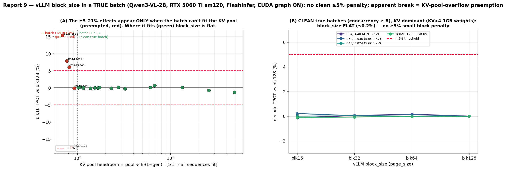

# Report 9 — vLLM `block_size` in a true batch (FlashInfer backend, CUDA graph ON, sm120)

> PI ask (relayed by Chuyue, 2026-06-25): set up vLLM and do the *same* no-prefix-sharing test +
> profiling across batch sizes and page sizes to find a case where **`page_size=1` has a >5% latency
> disadvantage**, with **FlashInfer as the backend and CUDA graph ON** ("which may appear unsupported
> for the machine, but is actually supported after proper set-up").

| | |
|---|---|
| **Question** | In vLLM (not SGLang), true batch, FlashInfer + CUDA graph ON: is the smallest `page_size` ever ≥5% slower? |
| **Answer** | **(i)** vLLM-FlashInfer **rejects `block_size < 16`** (so literal `ps1` is inexpressible; smallest page = 16). **(ii)** In a **clean true batch** (all B sequences fit the KV pool, no preemption) `block_size` is **flat — ≤0.2%** even in the KV-dominant regime → **no ≥5% small-page penalty**, matching SGLang (reports 5 & 8) and report 8's page-flat kernel. **(iii)** An initial sweep *appeared* to break ≥5% (`blk16` +15.3% at B128/L512; `blk128` +21% over-read at B256/L128), but the **audit traced this to KV-pool-overflow preemption** — those batches exceed the ~57–65 k-token pool on 16 GB (max concurrency < B), so vLLM wave-schedules; the effect vanishes once the batch fits. |
| **Engine / HW** | vLLM **0.23.0** (V1) · torch 2.11+cu130 · flashinfer **0.6.12** · Qwen3-VL-2B-Instruct · RTX 5060 Ti (16 GB, **sm120**) on **phastform** |
| **Regime** | **TRUE batch** — B distinct random-token prompts, `enable_prefix_caching=False` (no radix/prefix reuse) |
| **Backend / graph** | `attention_backend=FLASHINFER` (forced) · **CUDA graph ON** (`enforce_eager=False`; FULL+PIECEWISE captured) |
| **Metric** | decode **TPOT** via two timed generates (`(t_N − t_1)/(N−1)`, prefill cancels), median of 4–6 |
| **Data** | `offline_batch_results/vllm_smallkv_5060ti/` — `vllm_*` (sweep), `fit_*` (clean re-measure), `vfy_/eag_/clean_` (controls), `probe_blk*` |
| **Figure** | [fig_vllm_smallkv.png](fig_vllm_smallkv.png) |

---

## Headline

1. **vLLM + FlashInfer cannot express `page_size = 1` (or 8) on sm120.** With `attention_backend=FLASHINFER`,
   `block_size ∈ {1, 8}` fails engine init (`ValueError: … Reason: ['block_size not supported']`). Only
   `{16, 32, 64, 128}` boot; the *literal* `ps1` pathology is unrepresentable.

2. **In a clean true batch, `block_size` is flat — no ≥5% small-page penalty.** Re-measured on KV-dominant cells
   that genuinely fit the KV pool (max concurrency ≥ B, no preemption — verified in every log), `blk16` vs
   `blk128` is **−0.1 … +0.2 %** even when KV (4.7–5.6 GB) exceeds the model weights (4.1 GB):

   | clean cell | KV | pool headroom | blk16 | blk32 | blk64 | blk128 | **blk16 vs blk128** |
   |---|---:|---:|---:|---:|---:|---:|---:|
   | B64 / L640  | 4.7 GB | 1.15 | 21.85 | 21.89 | 21.91 | 21.88 | **−0.1 %** |
   | B48 / L1024 | 5.6 GB | 1.02 | 23.67 | 23.67 | 23.66 | 23.67 | **+0.0 %** |
   | B32 / L1536 | 5.6 GB | 1.06 | 23.31 | 23.26 | 23.28 | 23.26 | **+0.2 %** |
   | B96 / L512  | 5.6 GB | 0.92 | 26.41 | 26.42 | 26.43 | 26.44 | **−0.1 %** |

   This matches SGLang in a true batch (reports 5 & 8: `ps1` tied) and report 8's finding that the FlashInfer
   **decode kernel is page-flat**. So the PI's hoped-for clean >5% small-page penalty **does not exist** in a
   true batch, in vLLM either.

3. **The initial sweep's apparent ≥5% break was a preemption artifact — not a page effect.** The first sweep
   reported `blk16` +6.1 % (B32/L2048), +7.9 % (B64/L1024), **+15.3 %** (B128/L512), and a reverse `blk128`
   +21 % at B256/L128. The audit found these cells **cannot be clean true batches on 16 GB**: each needs
   B·(L+gen) ≈ 70–82 k tokens but the KV pool holds only **56,672 (blk128) – 64,816 (blk16)** tokens, so
   max concurrency was **84–96× < B = 128/256** → vLLM **preempts / wave-schedules**, and the per-token timing
   reflects scheduling (and the block-dependent pool size), not a clean per-step page cost. The effect tracks
   the *pool overflow*, not the page size (Fig A): every cell with headroom < 1 shows it; every cell that fits
   is flat. (This is the same bs×ctx memory wall that makes SGLang OOM at 65 k true batch, reports 5 & 7 — vLLM
   merely hides it behind preemption.)

4. **Corroboration the cost isn't the kernel.** The isolated FlashInfer decode kernel is page-flat at the exact
   B128/L512 footprint (`ps16/ps128 = −0.9 %`; report 8 to 537 MB), and the apparent break is **CUDA-graph-only**
   (eager is ~2× slower, overhead-dominated, and the effect washes out) — both consistent with a
   preemption/scheduling artifact rather than a real paged-decode kernel penalty.

The lasting deliverable beyond the null result is **(a)** the sm120 vLLM+FlashInfer+graph setup recipe (§1), and
**(b)** a methodological caution: at batches that overflow the KV pool, preemption produces an *apparent*,
block-size-dependent ≥5% "page penalty" that is not one — you must verify `max concurrency ≥ B` before trusting
a true-batch page comparison.

## 1. Setting up vLLM + FlashInfer + CUDA graph ON on sm120 (the "appears unsupported" part)

vLLM 0.23.0 with `attention_backend=FLASHINFER` *is* supported on sm120, after clearing four blockers (all fixed
**inside the venv — no system/sudo changes**); recipe in [vllm_env.sh](../scripts/vllm_env.sh):

| # | symptom | root cause | fix |
|---|---|---|---|
| 1 | flashinfer JIT `ninja … exit 127`, `/usr/local/cuda-13.0/bin/nvcc: not found` | `/usr/local/cuda-13.0` is **only Nsight Compute** (no nvcc); system CUDA 12.8 < 12.9 (can't target `sm_120f`) | `CUDA_HOME` = the venv pip toolkit `nvidia/cu13` (**nvcc 13.2**) |
| 2 | `"CUDA compiler and CUDA toolkit headers are incompatible"` | pip `cuda-toolkit 13.0.2` is version-skewed (nvcc 13.2 vs headers 13.0); cccl rejects the minor mismatch | `NVCC_APPEND_FLAGS="-DCCCL_DISABLE_CTK_COMPATIBILITY_CHECK"` (documented cccl escape; safe within CUDA-13) |
| 3 | link `cannot find -lcudart`, `collect2: ld returned 1` | flashinfer links `-L $CUDA_HOME/lib64 -lcudart -lcuda`; pip toolkit uses `lib/`, no unversioned `libcudart.so`, empty `stubs/` | venv symlinks: `lib64→lib`, `libcudart.so→libcudart.so.13`, `stubs/libcuda.so→/usr/lib/.../libcuda.so` |
| 4 | attention ran on **FLASH_ATTN** despite `VLLM_ATTENTION_BACKEND=FLASHINFER` | vLLM 0.23 **removed that env var** | pass `LLM(attention_backend="FLASHINFER")` (EngineArg) |

After these the engine boots with **CUDA graph ON** (captures 51 piecewise + 35 full-decode graphs) and logs
`Using AttentionBackendEnum.FLASHINFER backend.` + `Warming up FlashInfer attention.` (The vision tower keeps
FLASH_ATTN — irrelevant; the benchmark uses token-id prompts, no images.)

## 2. `block_size` support — `page_size = 1` is inexpressible

Probe (`probe_blk*.json`, bs1/L512, FlashInfer, graph ON):

| block_size | 1 | 8 | 16 | 32 | 64 | 128 |
|---|---|---|---|---|---|---|
| result | **REJECT** | **REJECT** | OK | OK | OK | OK |
| TPOT (ms) | — | — | 9.01 | 8.80 | 8.88 | 9.03 |

`block_size < 16` raises `['block_size not supported']` (FlashInfer paged-KV constraint on this build), so the
smallest expressible page is 16. Even at bs1 the smallest block (16) is only +2.4 % vs the fastest (32).

## 3. The hunt, the artifact, and the clean result


**Initial sweep (apparent break).** `block_size ∈ {16,32,64,128}` × batch `{1..256}` × several ctx, distinct
random-token prompts, `enable_prefix_caching=False`, graph ON. It showed flat `block_size` at small/medium total
KV but an apparent `blk16` penalty rising with total KV — +6.1 % (B32/L2048), +7.9 % (B64/L1024), **+15.3 %**
(B128/L512) — plus a reverse `blk128` +21 % at B256/L128.

**Audit → the apparent break is preemption, not a page effect.** Reading the vLLM logs, the "break" cells have
**max concurrency 84–96× < their batch (128/256)**: the KV pool (56,672–64,816 tokens, blk128–blk16) cannot hold
B·(L+gen) ≈ 70–82 k tokens, so vLLM **wave-schedules/preempts** them — they are *not* clean true batches. The
pool size itself shrinks with larger blocks (coarser allocation), coupling block size into the preemption. As
**Fig A** shows, the effect is a pure function of **pool headroom** (`pool ÷ B·(L+gen)`): every preempted cell
(headroom < 1) shows ±6–21 %; every cell that fits (headroom ≥ 1) is flat.

**Clean re-measure (Fig B; Headline §2).** On KV-dominant cells chosen to fit (`max concurrency ≥ B` verified),
`block_size` is **flat to ≤0.2 %** — including 5.6 GB-KV cells where KV ≫ the 4.1 GB weights. So in a genuine
true batch the small page carries **no ≥5 % penalty**.

### 3.1 Controls — why the verdict is "no clean penalty"
| control | result | conclusion |
|---|---|---|
| **Clean fitting cells** (concurrency ≥ B, KV-dominant) | `blk16/blk128` = −0.1 … +0.2 % | no page penalty in a clean true batch |
| **Pool-headroom classification** (Fig A) | ±6–21 % iff headroom < 1; flat iff ≥ 1 | the "break" is **pool-overflow preemption**, not page size |
| **Isolated kernel** (`bench_xqa`, B128/L512, distinct) | `ps16/ps128 = −0.9 %`, `ps1 = −0.4 %` (report 8 flat to 537 MB) | the decode **kernel** is page-flat (not the cause) |
| **CUDA graph ON vs OFF** at B128/L512 | graph-ON +15 %; eager ≈ 104 ms (2.5× slower), effect washes out | apparent break is graph-mode/scheduling, not a steady kernel cost |
| **Reversed block order** | reproduces the (preempted) numbers exactly | the artifact is deterministic, not ordering/thermal noise |
| **Cross-engine, where both fit** (SGLang 32 k true batch) | SGLang `ps1≈ps16` flat (B32/L1024 +0.1 %, B64/L512 −0.4 %, B128/L256 −0.2 %) | engines agree: flat clean true batch |

## 4. Relation to the rest of the study
- **Consistent with reports 5, 7, 8 (and confirmed cross-engine):** a true batch has **no ≥5 % small-page
  decode penalty** — now shown in **both** SGLang and vLLM, with FlashInfer and CUDA graph ON. The page penalty
  remains exclusive to the **shared-prefix + gather-sensitive-kernel (Triton)** regime (reports 3 & 7).
- **The 65 k-token true batch is unreachable cleanly on 16 GB in either engine** — SGLang `bench_one_batch`
  OOMs (un-chunked prefill), vLLM preempts (chunked prefill). The apparent vLLM "break" lived precisely in that
  unfittable regime; report 8's roofline already implied a true batch stays page-insensitive wherever it can
  actually run.
- **Methodological contribution:** preemption at KV-pool overflow can masquerade as a block-size penalty
  (here up to ±21 %). Any true-batch page comparison must confirm `max concurrency ≥ B`.

## 5. Caveats / honesty
- vLLM-FlashInfer can't express `block_size < 16`, so literal `ps1` is untestable in vLLM; the clean comparison
  is `blk16` vs `blk128`.
- The initial +15.3 % was **reported then retracted** by this report's own audit — it is a real, reproducible
  *number* but an artifact of pool-overflow preemption, not a clean true-batch page penalty. It is kept here as
  the worked example of the methodological caution.
- Clean cells are KV-dominant (KV 4.7–5.6 GB > 4.1 GB weights) but capped at ~5.6 GB by the 16 GB card; deeper
  KV-dominance in a *clean* true batch isn't reachable here (it would need a bigger card / chunked-prefill that
  still keeps all sequences resident).
- vision-tower attention uses FLASH_ATTN; only the language-model decode (TPOT) is FlashInfer. TPOT via
  two-generate subtraction, 4–6 repeats, per-launch std ≤0.2 %.

## 6. Reproduce
```bash
# phastform — sm120 vLLM+FlashInfer env (venv-local, no sudo): see scripts/vllm_env.sh
source ~/vllm_env.sh
bash page_size_study/scripts/vllm_smallkv_sweep.sh   # initial bs×block sweep (apparent break)
bash page_size_study/scripts/vllm_fit.sh             # CLEAN re-measure on fitting cells (concurrency>=B)
bash page_size_study/scripts/vllm_verify.sh          # reversed-order + graph ON/OFF controls
# locally:
python3 page_size_study/scripts/analyze_vllm_smallkv.py     # tables (+ check "Maximum concurrency >= B" per log)
python3 page_size_study/scripts/make_vllm_smallkv_figure.py # fig_vllm_smallkv.png (headroom classification + clean cells)
```

Companion reports: [report_5](../report_5_bench_one_batch/report_5_bench_one_batch.md),
[report_7](../report_7_sharedprefix_mechanism/report_7_sharedprefix_mechanism.md),
[report_8](../report_8_smallkv_truebatch/report_8_smallkv_truebatch.md) (SGLang true-batch & mechanism — same verdict: no clean true-batch page penalty).
