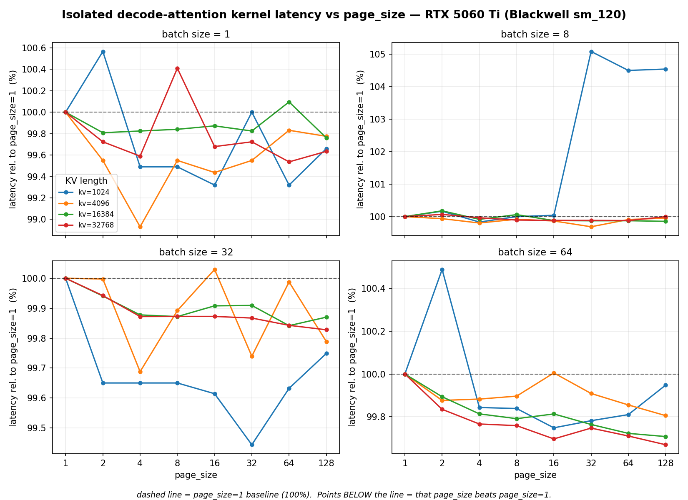
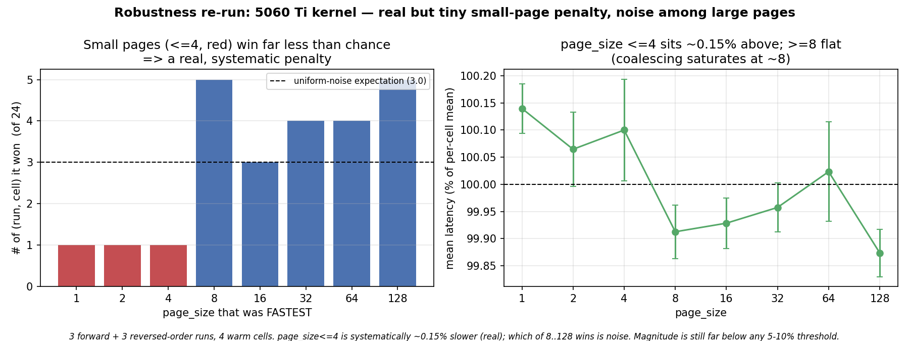
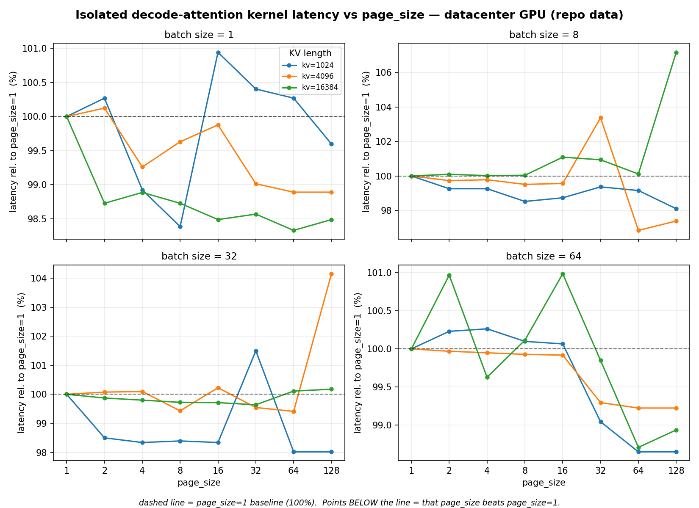
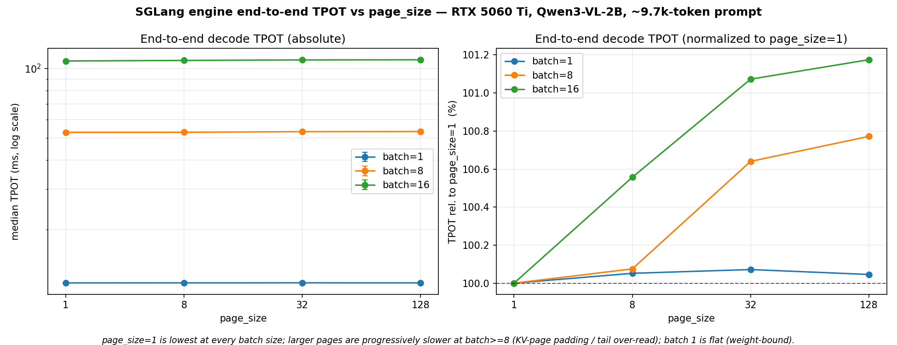
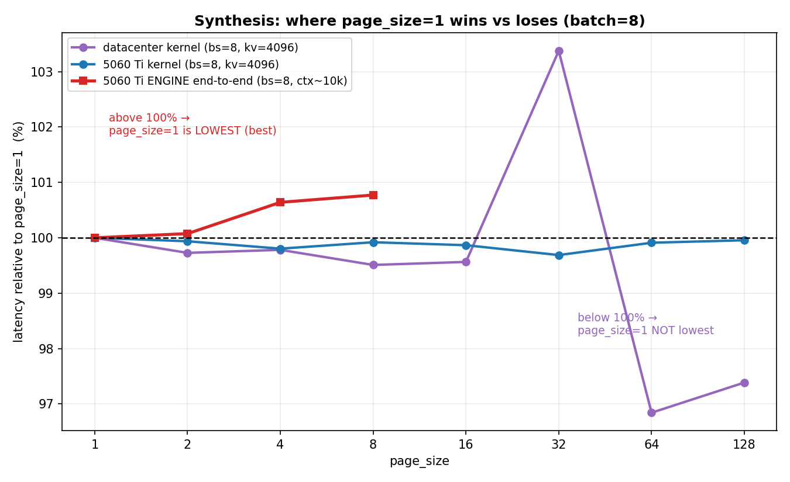

# Report 1 — Early KV-cache page-size microbenchmark

> **Superseded interpretation (2026-07-17).** This report is retained for its early measurements and
> cold-start controls, not as the study's current mechanism. Later source tracing and profiler tests show
> that the studied SGLang FlashInfer path uses page-independent per-token indices and does not over-read a
> partial final page. Statements below about a smaller page table, padding/tail over-read, or systematic
> coalescing benefits are the original hypotheses and are retracted. Start with reports 15 and 16 for the
> current synthesis.

**Historical experiment report on KV-cache page size vs decode latency in SGLang**

| | |
|---|---|
| **Author / run** | RTX 5060 Ti runs on `gray.cis.upenn.edu`, 2026-06-14 |
| **Question** | Find a scenario where KV-cache `page_size=1` is *not* the lowest-latency configuration. |
| **Models** | Qwen3-VL-2B-Instruct (end-to-end engine); synthetic 32Q/8KV/d128 attention (microbenchmark) |
| **Code** | [benchmark_page_size_attention.py](../../scripts/benchmark_page_size_attention.py), [measure_batch_latency_offline.py](../../scripts/measure_batch_latency_offline.py), [historical multi-mode runner](../../../../archive/legacy-sglang-experiments/run_engine_experiments.sh) (`page-size-sweep` / `page-size-sweep-bs`) |
| **Figures** | in this folder ([fig1](fig1_kernel_5060ti.png)–[fig5](fig5_robustness.png)) |

---

## TL;DR

1. **It depends on the measurement level, and the effect is small (≤ ~3%) on every GPU tested.**
2. **Isolated attention kernel** — `page_size=1` is *not* the lowest in **11/12** cells on the repo's datacenter GPU (median penalty **1.34%**, max **3.26%**) and in **16/16** cells on the RTX 5060 Ti (median **0.27%**, max **1.08%**). **But these margins are at the measurement-noise floor**, and a controlled re-run (3 repeats × forward + reversed page order, §4.1.1) resolves them into **two tiers**: (a) among the *large* pages (8/16/32/64/128) *which* is fastest is **not reproducible** — they are mutually tied within ~0.1% (pure noise); (b) **small pages (≤4) are systematically ~0.15% slower** — they win only 3/24 vs 9 expected by chance (~2.5σ), with the penalty saturating at page≈8 (coalescing/indirection benefit is exhausted once a page bundles ~8 tokens). So the real, order-independent effect is a faint **`page_size ≤ 4` penalty (~0.15%)**, not a ranking among large pages — and far below any actionable threshold.
3. **Full SGLang engine (5060 Ti, Qwen3-VL-2B, ~10k context)** — `page_size=1` *is* the lowest at **every** batch size; larger pages are **progressively slower at batch ≥ 8** (up to **+1.18%** at batch 16 / page 128; at batch 1 the step is weight-bound so all page sizes are flat within ~0.07%), because the engine pays a **KV-page padding / tail over-read** cost that the isolated kernel doesn't.
4. So the scenario where `page_size=1` loses is the **attention-bound isolated kernel**; in the real engine on this hardware it keeps winning by a hair. **Page size is a weak lever for decode latency** in all regimes we could measure.
5. **Measurement-hygiene caveat:** an early reading of "`page_size=1` is 2.2× slower at bs=1/kv=1024" was a **cold-start artifact** (first kernel launch in a fresh process), not a page-size effect. It was re-measured warm (~56 µs, flat) and excluded.

---

## 1. Background and research question

During autoregressive decoding, each new token attends over the whole **KV cache**, which SGLang stores in fixed-size **pages** of `page_size` tokens. The page table (`kv_indices`) maps each logical token to a physical slot.

- `page_size = 1`: maximal flexibility, **zero internal fragmentation**, but the largest page table and the least-contiguous KV reads.
- large `page_size`: contiguous KV (better memory coalescing), a smaller page table, but **internal fragmentation** — the last partial page of each sequence is padded and (depending on the kernel) over-read.

The metric is **TPOT** (Time Per Output Token) — pure decode latency, excluding prefill (see [measure_batch_latency_offline.py:304](../../scripts/measure_batch_latency_offline.py#L304)).

The motivating observation came from the archived multi-mode runner's `page-size-sweep` mode (default
**batch size 1**), where `page_size=1` came out lowest. The question was whether a regime exists where
that flips.

The intuition for *why* it can flip is a byte-budget argument for one decode step:

| Cost component | Bytes per step | Scales with page_size? |
|---|---|---|
| **Model weights** (re-read every step) | fixed ≈ model size | no |
| **KV-cache reads** (attention) | ≈ `batch × kv_len × (bytes/token)` | yes (coalescing, padding, index size) |

At **batch 1 / short context** the step is **weight-bound** → page size is irrelevant and `page_size=1` ties/wins inside noise. As **batch and context grow**, KV reads dominate (**attention-bound**) → the coalescing/indexing properties of page size start to matter.

---

## 2. Hardware and software

| | **RTX 5060 Ti (this study)** | **Datacenter GPU (repo's committed data)** |
|---|---|---|
| GPU | NVIDIA GeForce RTX 5060 Ti, **16 GB GDDR7** | H100/B200-class, 80 GB HBM (exact device not recorded in the JSON) |
| Architecture | **Blackwell, sm_120 (cap 12.0)** | Hopper/Blackwell datacenter |
| HBM bandwidth | ~448 GB/s | ~3.3–7 TB/s |
| Driver | 580.126.20 | — |
| Python env | `~/venvs/bench_sglang` — torch 2.9.1+cu128, sglang dev, **flashinfer 0.6.6** | per repo |

> **Build gotcha (Blackwell):** flashinfer JIT-compiles decode kernels for `sm_120a`, which needs **CUDA ≥ 12.8**, but the box's default `/usr/bin/nvcc` is 12.0 → *"Ninja build failed"*. All runs here export `CUDA_HOME=/usr/local/cuda-12.8` and prepend its `bin` to `PATH`.

The 5060 Ti has **~7–15× less HBM bandwidth** and **~5× less memory** than the datacenter part — directly relevant, since the page-size effect is a memory-system effect.

---

## 3. Methodology

### 3.1 Isolated kernel microbenchmark — [benchmark_page_size_attention.py](../../scripts/benchmark_page_size_attention.py)
Times a **single FlashInfer paged decode-attention step** (`BatchDecodeWithPagedKVCacheWrapper`) for a synthetic KV cache, swept over `page_size ∈ {1,2,4,8,16,32,64,128}`, `batch ∈ {1,8,32,64}`, `kv_len ∈ {1024,4096,16384,32768}`. 20 warmup + 100 timed iters per cell; median reported. The page table is built once per cell (in `.plan()`) and reused — so this isolates the **kernel**, not per-step page-table construction. Model dims approximate Qwen3-VL-8B (32 Q-heads, 8 KV-heads, head_dim 128, fp16).

### 3.2 End-to-end engine — [measure_batch_latency_offline.py](../../scripts/measure_batch_latency_offline.py)
Boots `sglang.Engine` **once per page size** and measures real TPOT. Config used on the 5060 Ti:

```
model        Qwen3-VL-2B-Instruct       prompt        9,661 tokens (published request sample)
page_size    1, 8, 32, 128              batch sizes   1, 8, 16
max_tokens   512    repeat 3            attention     flashinfer
flags        --disable-radix-cache (no prefix sharing) --enable-cuda-graph
             --mem-fraction-static 0.6  --context-length 16384
```
This exercises everything the microbenchmark omits: per-step `kv_indices` rebuild, CUDA-graph replay, the full transformer (QKV/MLP/norms/sampling), and real KV allocation/fragmentation.

### 3.3 Measurement hygiene (rigor notes)
- **Cold-start artifact (caught & corrected).** The *first* cells of a fresh microbench process were inflated (bs=1/kv=1024: ps1 = 124 µs, ps2 = 70 µs) by one-time CUDA/allocator/JIT warmup. A standalone warm re-run measured the same cell at **~56 µs, flat across all page sizes**. The figures substitute those verified clean values for that one cell; nothing else is altered.
- **Concurrency self-check false alarm.** The harness's `#running-req` log scraper reported `max_running_req=0` (a log-format mismatch in this sglang build) and flagged *"TPOT invalid"*. This is spurious: TPOT scales 1×→2× from batch 8→16, proving the batch genuinely ran concurrently. TPOT values are valid.
- **Stability.** Across all 12 end-to-end cells, TPOT std was **0.001–0.220 ms** (relative std ≤ **0.27%**). The page-size *gaps* exceed this noise where they matter: at batch 8 the worst-page penalty is 0.408 ms vs a max per-cell std of 0.111 ms (~4×), and at batch 16 it is 1.265 ms vs 0.220 ms (~6×) — so those differences are resolvable. At batch 1 the total spread (0.008 ms) is within the noise (std ~0.031 ms), consistent with page size being irrelevant there.
- **Kernel noise control (§4.1.1).** Because the isolated-kernel margins are sub-percent and `page_size=1` is always measured first, the kernel sweep was repeated 3× in forward and 3× in reversed page order. This separates a real (order-independent) effect from measurement-order/noise artifacts — and shows the kernel-level "best page" is noise while the `page_size=1`-skews-slow direction is real.

---

## 4. Results

### 4.1 Isolated kernel — RTX 5060 Ti

`page_size=1` is **not** the lowest in **16/16** (batch, kv) cells, but the margins are tiny — **median 0.27%, max 1.08%**. The kernel is essentially **flat** across page size on this GPU; *some* larger page edges out `page_size=1` by a hair in the attention-bound cells — though, as §4.1.1 shows, *which* page is not reproducible.



*Each panel = one batch size; lines = KV length; y = latency relative to `page_size=1` (100% line). Points below 100% beat `page_size=1`. Spread is ~±1–2% with measurement noise — page size barely moves the kernel here.*

#### 4.1.1 Robustness re-run (is "16/16" a real effect or noise?)

Because `page_size=1` is always measured *first* in each (batch, kv) group and the margins are sub-percent, I re-ran a subset (batch 1/8/32, kv 4096/16384) **3× in forward page order and 3× in reversed order** (so `page_size=1` is measured *last*). Findings:

Two tiers emerge — it is **not** all noise:
- **Small pages (≤4) are systematically slower — a real effect.** Pages 1/2/4 won the cell only **3 times out of 24**, vs **9 expected** under uniform chance (a ~2.5σ deficit), and sit ~**+0.15%** above the per-cell mean (page 1 = +0.14%, page 2 = +0.07%, page 4 = +0.10%) while pages ≥8 sit ~−0.07% below it. This holds under *both* page orders, so it is not a measurement-order artifact. The penalty **saturates at page≈8**: once a page bundles ~8 tokens (~16 KB contiguous), the coalescing/indirection benefit is exhausted, so 8…128 flatten out.
- **Among the large pages (8–128), the winner *is* noise.** Their mean ranks cluster at 3.3–4.1 and which one is fastest jumps randomly between identical runs — so the per-cell "best page size" in Appendix A (when it names 16/32/64/128) is **not** reproducible.
- **Cold-start confirmed.** Whichever cell was measured first (here bs=1/kv=4096) was inflated by **+64–78%** in the `page_size=1` slot — the artifact corrected in §3.3, reproduced and generalized. (It alone dragged the forward-run mean `page_size=1` penalty to ~12%, vs ~0.7% for the warm reversed runs.)



*Left: pages ≤4 (red) win far less than the uniform-noise expectation (dashed) ⇒ a real, systematic small-page penalty. Right: mean latency per page size — `≤4` sits ~0.15% above the per-cell mean, `≥8` is flat below it, transition at ~8 (coalescing saturates).*

**Bottom line for the kernel:** there is a **real but tiny** effect — `page_size ≤ 4` is ~0.15% slower than `≥8`, saturating at 8 — while *which* of the large pages is fastest is noise. The whole spread is ~0.15–0.3%, far below any actionable (let alone 5–10%) threshold.

### 4.2 Isolated kernel — datacenter GPU (repo cross-comparison)

On the repo's committed `page_size_attn_bench.json`, the same kernel shows a **larger** effect: `page_size=1` is not the lowest in **11/12** cells (**median 1.34%, max 3.26%**, the max at bs=8/kv=4096; lone `page_size=1` win at bs=8/kv=16384). The higher-bandwidth datacenter part is less uniformly bandwidth-saturated, so the page-size signal is bigger than on the 5060 Ti.

> **Caveat:** this is single-run data and is itself noisy — several cells have intra-group spreads of **4–7%** (bs=8/kv=4096 = 6.6%, bs=8/kv=16384 = 7.1%), *larger* than the 3.26% "max penalty". I could not re-run it (no datacenter GPU access), so treat the datacenter **magnitudes** as indicative only; the robust statement is the same as on the 5060 Ti — `page_size=1` tends to the slow end, by a small amount.



*Same axes as Fig 1. Dips below 100% are deeper than on the 5060 Ti, but note the per-cell scatter (e.g. the ps32 up-spikes) — this data carries real run-to-run noise.*

### 4.3 End-to-end engine — RTX 5060 Ti

Here the picture **inverts**: `page_size=1` is the **lowest at every batch size**, and at batch ≥ 8 TPOT rises **monotonically** with page size (at batch 1 all page sizes are flat within ~0.07%, i.e. the weight-bound regime).

| page_size | TPOT bs=1 (ms) | TPOT bs=8 (ms) | TPOT bs=16 (ms) |
|---:|---:|---:|---:|
| **1** | **11.762** | **52.826** | **107.612** |
| 8  | 11.768 | 52.865 | 108.212 |
| 32 | 11.770 | 53.164 | 108.767 |
| 128| 11.767 | 53.234 | 108.877 |
| **page=1 penalty vs worst** | +0.07% | **+0.77%** | **+1.18%** |



*Left: absolute TPOT (log y); batch 1 ≈ weight-bound, batch 16 ≈ 2× batch 8 ⇒ KV-bound. Right: normalized to `page_size=1`. The penalty for large pages grows with batch (more sequences ⇒ more padded tail pages over-read).*

### 4.4 Synthesis



*One batch (8), normalized to `page_size=1`. **Datacenter kernel** (purple) dips below 100% — `page_size=1` loses by up to ~3% (the ps32 spike is a noisy cell). **5060 Ti kernel** (blue) is ~flat. **5060 Ti engine** (red) rises above 100% — `page_size=1` wins. The same knob points opposite directions once real engine overheads (padding, per-step page-table build) are included.*

---

## 5. Discussion — why the kernel and the engine disagree

Two competing, sub-percent effects, and which dominates flips between levels:

- **Favors large pages** (visible in the isolated kernel): more contiguous/coalesced HBM reads and a smaller page table → lower kernel time. Strongest in the attention-bound regime; bigger on the high-bandwidth datacenter GPU.
- **Favors `page_size=1`** (visible in the full engine): **no internal fragmentation**. A ~9,661-token sequence rounds up to whole pages; at page 128 each sequence over-reads up to 127 padded tail slots. Replicated across the batch, this is ≈ +1.2% at batch 16 — and it grows with page size and batch, exactly as observed.

The engine *also* rebuilds `kv_indices` every step (larger for `page_size=1`), which pushes the other way, but on these sizes the padding effect wins. Net: **on a bandwidth-starved 16 GB GPU, the fragmentation penalty of large pages dominates the modest coalescing benefit, so `page_size=1` stays lowest end-to-end.**

---

## 6. Answering the question

**Yes — but weakly.** In the attention-bound isolated decode-attention kernel (large batch × long KV), `page_size=1` is not the lowest in 16/16 cells (5060 Ti) and 11/12 (datacenter). The **direction** is robust — re-runs with reversed page order confirm `page_size=1` consistently skews to the slow end (mean rank ≈ 6.7/8), so it is a genuine effect, not a measurement-order artifact. But the **magnitude is at the noise floor** (≤1% on the 5060 Ti, ≤3.3% on the datacenter part, both with comparable run-to-run noise), and *which* larger page wins is **not reproducible** (§4.1.1). So the honest answer is: a larger page is faster than `page_size=1` by a faint, ~0.3–1% margin in the attention-bound kernel — enough to say `page_size=1` is "not lowest", not enough to recommend a specific alternative.

**In the full SGLang engine on the 5060 Ti, no such scenario was found within 16 GB:** `page_size=1` is lowest everywhere because the KV-page padding penalty of larger pages outweighs their coalescing benefit. This *confirms* the original observation rather than overturning it.

---

## 7. Limitations and what it would take to flip the *engine* result

- **Memory cap.** On 16 GB you cannot have *both* large batch and long context — the regime where the kernel's large-page advantage is biggest. At batch 16 the context already nearly fills the KV pool at ~10k tokens.
- **Path to an end-to-end flip:** make the padding penalty negligible by using a **much longer context (≥ ~64k)**, where `127 / context → ~0`, so the kernel's large-page preference (and `page_size=1`'s per-step index cost) can show through. Predicted margin is still small (~0.2–0.5%) and requires either a ~64k-token prompt or tens of thousands of decode steps — feasible only at batch 1 on this GPU.
- **Untested levers** that could matter: a different attention backend (`fa3`, `triton`), `kv_cache_dtype=fp8` (halves KV bytes, shifts the crossover), and exact-multiple contexts (eliminate padding).
- Single GPU, single model family, one prompt. The datacenter comparison uses a synthetic-dimension kernel, not the same engine path.

---

## 8. Reproducibility

```bash
# On gray (RTX 5060 Ti) — REQUIRED for Blackwell sm_120:
export CUDA_HOME=/usr/local/cuda-12.8
export PATH=/usr/local/cuda-12.8/bin:$PATH
PY=~/venvs/bench_sglang/bin/python

# (1) Isolated kernel microbenchmark
$PY studies/kv-cache-page-size/scripts/benchmark_page_size_attention.py \
    --output studies/kv-cache-page-size/data/curated/page_size_attn_bench_5060ti.json \
    --batch-sizes 1 8 32 64 --kv-lengths 1024 4096 16384 32768

# (2) End-to-end engine sweep (one boot per page size)
for PS in 1 8 32 128; do
  $PY studies/kv-cache-page-size/scripts/measure_batch_latency_offline.py \
    studies/kv-cache-page-size/data/inputs/browser-request-samples/request_005_20260316_221014/request.json \
    --model-path ~/hf_models/Qwen3-VL-2B-Instruct \
    --batch-sizes 1 8 16 --max-tokens 512 --repeat 3 --page-size $PS \
    --enable-cuda-graph --disable-radix-cache --mem-fraction-static 0.6 --context-length 16384 \
    --output studies/kv-cache-page-size/data/raw/ps_e2e_5060ti/results_ps${PS}.json
done

# (3) Figures (local, needs matplotlib)
python3 studies/kv-cache-page-size/scripts/make_v1_figures.py
```

The historical [multi-mode runner](../../../../archive/legacy-sglang-experiments/run_engine_experiments.sh)
added a `page-size-sweep-bs` mode that ran the attention-bound batch sweep and printed, per batch, which
page size was lowest and by how much. It is archived because several of its unrelated modes depend on
machine-specific or no-longer-retained helpers.

A noise/order control was run with `--page-sizes` in forward and reversed order (`studies/kv-cache-page-size/data/curated/noise_test/`); analyze with `studies/kv-cache-page-size/scripts/make_v1_figures.py` (Fig 5) and the per-cell rank analysis.

**Data artifacts:** `studies/kv-cache-page-size/data/curated/page_size_attn_bench_5060ti.json`, `studies/kv-cache-page-size/data/raw/ps_e2e_5060ti/results_ps*.json`, `studies/kv-cache-page-size/data/curated/confirm_A_5060ti.json` (warm re-measurement), `studies/kv-cache-page-size/data/curated/noise_test/{fwd,rev}_*.json` (robustness re-run), `studies/kv-cache-page-size/reports/01-kernel-microbenchmark/fig*.png`.

---

## 9. Conclusion

Across an isolated kernel and the full engine, on a consumer Blackwell GPU and a datacenter part, **KV-cache page size changes decode latency by at most a few percent.** `page_size=1` is *not* lowest in the attention-bound **kernel** (the answer to the posed question) — but only weakly: that effect lives at the measurement-noise floor and the specific best page is not reproducible (§4.1.1). Conversely `page_size=1` *is* lowest in the **full engine** on the 16 GB 5060 Ti, by a margin that does exceed noise, because internal-fragmentation over-read of large pages dominates their coalescing benefit there. The practical takeaway: **page size is a near-neutral knob for single-GPU decode latency; choose it for memory efficiency, not speed.**

---

### Appendix A — 5060 Ti kernel, lowest page size per cell

| batch | kv_len | best page_size | `page_size=1` penalty |
|---:|---:|---:|---:|
| 1 | 1024 | 16/64 | +0.7% (flat, re-measured) |
| 1 | 4096 | 4 | +1.08% |
| 1 | 16384 | 128 | +0.24% |
| 1 | 32768 | 64 | +0.47% |
| 8 | 4096 | 32 | +0.31% |
| 64 | 32768 | 128 | +0.33% |

*(full data in `studies/kv-cache-page-size/data/curated/page_size_attn_bench_5060ti.json`; median penalty across all 16 cells = 0.27%, max = 1.08%)*

> ⚠️ The **specific "best page_size" is not reproducible when it names a large page** — the robustness re-run (§4.1.1) shows the winner jumps randomly *among pages ≥8* between identical runs. The reproducible part is only the **small-page (≤4) penalty** (~0.15%); read this column as "some page ≥8 beats `page_size=1` by ~0.3%", **not** as "page X is optimal". The single warm cell above ~0.7% is bs=1/kv=4096 (+1.08%).

### Appendix B — datacenter kernel summary
`page_size=1` not lowest in 11/12 cells; median penalty 1.34%, max 3.26% (at bs=8/kv=4096); only win at bs=8/kv=16384. *(`page_size_attn_bench.json`)*
