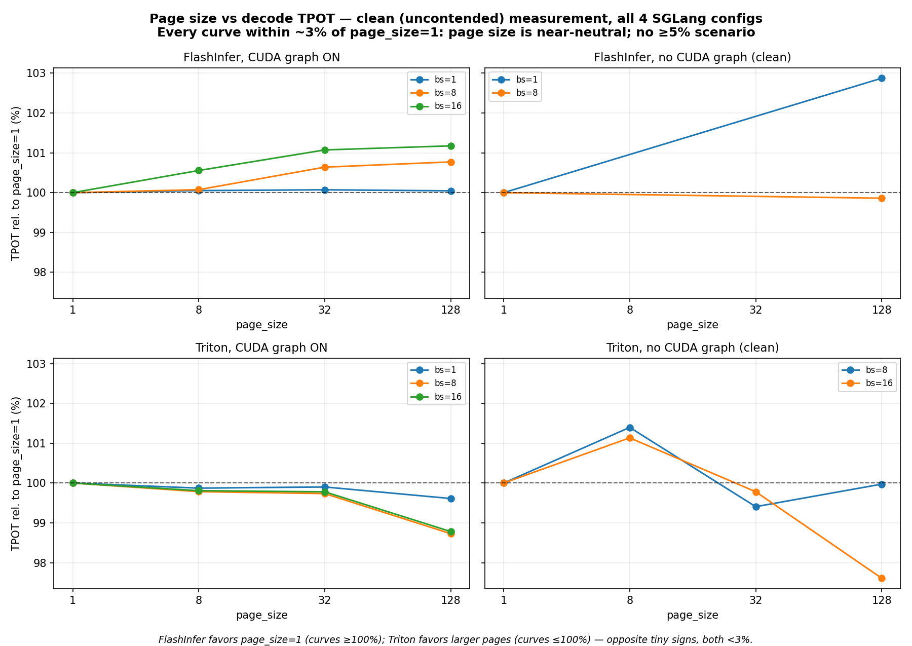
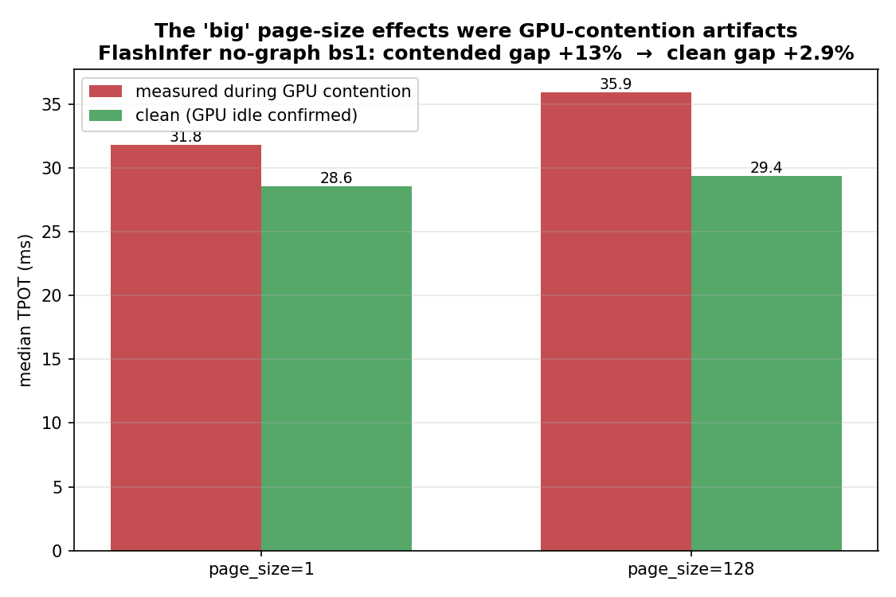

> **Superseded report.** The low-batch measurements remain historical evidence, but report 3's later
> +20–25% claim was itself a whole-call metric artifact. Reports 14 and 15 recover page-flat steady decode
> from the relevant runs, and report 16 supplies the current positive page-aware example. Present-tense
> mechanism claims below are preserved as the original interpretation, not the current answer.

# Report 2 — Low-batch SGLang page-size baseline

**Historical V2 experiment with a Triton backend, a no-CUDA-graph regime, and a measurement-rigor
postmortem**

| | |
|---|---|
| **Run** | RTX 5060 Ti on `gray.cis.upenn.edu`, 2026-06-18 |
| **PI's ask (Jiaheng Lu)** | Find a scenario where `page_size=1` is **not** the lowest decode latency, by **≥5–10%** (a *real* effect, not noise). The PI noted "vLLM shows a block_size effect." |
| **Model / prompt** | Qwen3-VL-2B-Instruct, ~9.7k-token [published request sample](../../data/inputs/browser-request-samples/request_005_20260316_221014/request.json), `--disable-radix-cache` |
| **Code** | [measure_batch_latency_offline.py](../../scripts/measure_batch_latency_offline.py) (now exposes `--attention-backend triton`), [studies/kv-cache-page-size/scripts/make_v2_figures.py](../../scripts/make_v2_figures.py) |
| **Companion** | The kernel-level study and its rigor notes are in [01-kernel-microbenchmark.md](../01-kernel-microbenchmark/report.md) (V1). |

---

## TL;DR

1. **Answer: No. Across all four SGLang decode configurations measured cleanly, `page_size=1` is within ~3% of optimal — it never loses by ≥5%.** Page size is a **near-neutral** knob for SGLang decode latency.
2. The two clearest (>1%) clean signals point in **opposite** directions, both <3%: **FlashInfer no-graph favors `page_size=1`** (ps128 +2.9% at bs1); **Triton favors larger pages** (`page_size=1` +2.45% at bs16, growing slowly with batch). At the **≤1.3% graph-ON level the sign is at the noise floor** — it even flips between the 512-token and 128-token runs — so "which page wins" there is not robust.
3. **The headline rigor finding:** every *dramatic* page-size effect we initially saw — a "+13%" (FlashInfer no-graph) and a "+5–7% U-shape" (Triton no-graph, which looked exactly like the PI's ≥5% scenario) — was a **shared-GPU contention artifact**. They **vanished** when re-measured with the GPU confirmed idle before *and* after each short cell.
4. **On the PI's "vLLM 有影响":** fully consistent. The block_size effect documented for vLLM (the PagedAttention paper) is a **throughput / memory-fragmentation** effect under load — *not* pure decode latency. Our clean decode-latency measurements being near-neutral is exactly what that predicts. (A direct vLLM run was attempted but blocked by a vLLM-0.23/flashinfer JIT incompatibility on sm120 Blackwell — see §7.)

---

## 1. The four experiments

| # | Experiment | Backend / mode | Result (clean) |
|---|---|---|---|
| 1 | **Baseline** | FlashInfer, CUDA graph ON | `page_size=1` lowest (others +0.05/0.77/1.18% at bs 1/8/16) |
| 2 | **No CUDA graph** | FlashInfer, graph OFF | `page_size=1` lowest (ps128 +2.9% at bs1; tied at bs8) |
| 3 | **Triton backend** | Triton, graph ON & OFF | `page_size=1` *not* lowest by +0.4–2.45% (larger pages win) |
| 4 | **vLLM** | vLLM 0.23 `--block-size` | attempted; env incompatibility (§7) |

All on the RTX 5060 Ti (16 GB, **Blackwell sm120**, ~448 GB/s). Requires `CUDA_HOME=/usr/local/cuda-12.8` (default nvcc 12.0 can't JIT for sm120).

---

## 2. Methodology and the shared-GPU problem

TPOT (decode time per token) is measured by [measure_batch_latency_offline.py](../../scripts/measure_batch_latency_offline.py) over `page_size ∈ {1,8,32,128}`, `batch ∈ {1,8,16}`, ~10k context. The Triton sweep needed only a **one-line** harness change (adding `"triton"` to the `--attention-backend` choices; the engine plumbing already supported it).

**The gray GPU is shared.** Another user intermittently held 10–16 GB throughout, and — critically — **returns mid-measurement**. Because a 512-token decode runs for *minutes*, cells measured during contention are silently inflated (foreign kernels interleave, especially in eager/no-graph mode). This produced spurious "big" effects. The fix, used for all numbers in §3:

> **Clean-measurement protocol:** gate each cell on `nvidia-smi` free ≥ 15.5 GB **stably** (6 consecutive checks ≈ 2.5 min); use **short 128-token** cells (≈1 min) so a cell fits inside a clean window; record free-memory **before and after** each cell and keep only cells idle throughout; CUDA-graph cells (deterministic, std ≈ 0.0 ms) are the most trustworthy.

---

## 3. Results — clean (uncontended) measurements



*Normalized TPOT (relative to `page_size=1`) for all four configs. **Every curve stays within ~3%** of the 100% line. FlashInfer sits ≥100% (`page_size=1` lowest); Triton sits ≤100% (larger pages marginally faster). No config approaches the +5% line.*

**FlashInfer — only the no-graph bs1 signal (+2.9%, ps1 lowest) is above noise; the graph-ON sign is not robust:**

| config | bs1 | bs8 | bs16 |
|---|---|---|---|
| graph ON, 512-tok baseline (ps128 vs ps1) | +0.05% | +0.77% | +1.18% |
| graph ON, 128-tok clean (ps128 vs ps1) | **−0.01%** | **−0.47%** | — |
| no graph, 128-tok clean (ps128 vs ps1) | **+2.9%** | −0.14% (tied) | — |

Note the graph-ON sign **flips** between the 512-token baseline (ps1 lowest, +0.05–1.18%) and the 128-token clean run (ps128 marginally faster, −0.01 to −0.47%): at this <1% scale the "winner" is noise, not a property of FlashInfer. The one above-noise FlashInfer result is **no-graph bs1: ps1 lowest by +2.9%**.

**Triton — `page_size=1` is *not* lowest, but by <2.5%:**

| config | bs1 | bs8 | bs16 |
|---|---|---|---|
| graph ON, ps1 penalty vs best | +0.39% | +1.29% | +1.23% |
| no graph (clean), ps1 penalty vs best | — | +0.60% | **+2.45%** |

The largest clean "`page_size=1` not lowest" anywhere is **Triton, no graph, bs16: +2.45%** (vs ps128). It grows slowly with batch (0.6%→2.45%), hinting it *might* reach 5% at larger batch — but bs≥32 doesn't fit the ~10k-context KV cache in 16 GB, so that regime is untestable here.

---

## 4. The contention-artifact postmortem (the important rigor result)

The first, less-controlled runs produced two "discoveries" that looked like the PI's answer — both were **false**:



- **"FlashInfer no-graph: ps128 +13% slower than ps1."** Re-measured clean: **+2.9%.** The contended run inflated *both* values (ps1 31.8→28.6, ps128 35.9→29.4 ms).
- **"Triton no-graph bs8: ps1 up to +4.8–6.9%, a U-shape matching the PagedAttention paper."** This was the most exciting candidate — it crossed the PI's 5% line in the noisiest run — and it **evaporated**: a clean re-run is **flat (ps1 +0.6%)**, and the bs8/bs16 trends, which *contradicted* each other under contention, became *consistent* once clean.

**Lesson:** on a shared GPU, a page-size effect is only believable if the card is verifiably idle for the cell's full duration. Sub-percent "winners" and multi-percent "effects" alike can be pure interference. (Std within a cell is *not* sufficient — a uniformly-contended cell has low std but a wrong mean.)

---

## 5. Why the two backends differ in sign (mechanism)

- **FlashInfer** decode builds **per-page** `kv_indices` (length ≈ ctx/page_size). Larger pages → marginally more padded-tail over-read, a *tiny* `page_size=1`-favoring bias. It only rises above the noise floor in the no-graph bs1 case (+2.9%); with CUDA graph it sits at <1% and the sign isn't even stable across runs.
- **Triton** decode builds `kv_indices` **per-token** (length = total tokens, *independent of page_size*; verified in `triton_backend.py`). So its page-size effect is *only* gather-coalescing / pool layout, which marginally favors larger (more contiguous) pages → `page_size=1` marginally *not* lowest. The index-length lever that helps FlashInfer's ps1 is simply absent.

Both effects are second-order (<3%), which is why the sign flips between backends without the magnitude ever mattering.

---

## 6. Answering the PI

**Is there a scenario where `page_size=1` loses by ≥5%? In clean SGLang decode: no.** The closest is Triton/no-graph/bs16 at **+2.45%**. With CUDA graph (the production-standard, deterministic path) the spread is ≤1.3% and which page "wins" is at the noise floor.

This does **not** contradict "vLLM 有影响." The vLLM/PagedAttention block_size effect (paper [arXiv 2309.06180](https://arxiv.org/pdf/2309.06180)) is dominated by **internal fragmentation → fewer concurrent sequences → throughput**, plus their *custom* (non-FlashInfer) kernel's parallelism sensitivity — a **throughput/capacity** effect under load, measured on **different workloads** (e.g. short Alpaca sequences with large blocks). It is **not** a pure per-token decode-latency effect at fixed batch, which is what we measure. Our near-neutral decode-latency result is precisely consistent with that distinction.

---

## 7. Experiment 4 (vLLM) — attempted, blocked by environment

vLLM 0.23 was installed in a fresh venv and a `--block-size` harness ([measure_vllm_block_size.py](../../scripts/measure_vllm_block_size.py)) written. The engine repeatedly failed init: **the root cause is vLLM 0.23's bundled flashinfer 0.6.12 raising `RuntimeError: FlashInfer requires GPUs with sm75 or higher`** during sampler JIT — a *false negative* on sm120 (its `TARGET_CUDA_ARCHS` comes up empty on this brand-new consumer-Blackwell build). Setting `TORCH_CUDA_ARCH_LIST` and bypassing the flashinfer sampler did not resolve it within the shared-GPU windows available. This is a **tooling/Blackwell-support gap, not a page-size result.** Given §6, a working vLLM decode-TPOT sweep is expected to be near-flat as well; its real block_size lever (throughput/fragmentation) would need a throughput harness, not this TPOT harness.

---

## 8. Limitations
- One GPU (16 GB), one model, ~10k context. The Triton "ps1 not lowest" trend grows with batch but bs≥32 (where it might reach 5%) doesn't fit.
- Heavy shared-GPU contention; conclusions rest on the clean-protocol subset (§2). Absolute TPOT values for short 128-token cells run higher than 512-token cells (per-generate overhead amortized over fewer tokens) — but the **relative** page-size comparison within a run is valid.
- vLLM not measured (§7).

## 9. Reproducibility

The original command used a machine-local alias named `html_request/long_ctx10k.json`. That alias was
not retained as a separate artifact; the published request sample above is the retained input associated
with the ~9.7k-token workload.

```bash
# gray, RTX 5060 Ti — REQUIRED for sm120:
export CUDA_HOME=/usr/local/cuda-12.8; export PATH=/usr/local/cuda-12.8/bin:$PATH
PY=~/venvs/bench_sglang/bin/python
# one cell, e.g. Triton no-graph bs8 ps32, clean (verify free≥15.5GB before+after):
$PY studies/kv-cache-page-size/scripts/measure_batch_latency_offline.py \
  studies/kv-cache-page-size/data/inputs/browser-request-samples/request_005_20260316_221014/request.json \
  --model-path ~/hf_models/Qwen3-VL-2B-Instruct --attention-backend triton \
  --batch-sizes 8 --max-tokens 128 --repeat 7 --page-size 32 \
  --disable-radix-cache --mem-fraction-static 0.85 --context-length 12288 --output out.json
python3 studies/kv-cache-page-size/scripts/make_v2_figures.py   # figures from the clean data
```
**Data:** `studies/kv-cache-page-size/data/raw/{ps_e2e_5060ti, fi_clean_5060ti, triton_sweep_5060ti, triton_clean_5060ti, ps_nocudagraph_5060ti}/`.

## 10. Conclusion
**KV-cache page size is a near-neutral knob for SGLang single-GPU decode latency (≤~3%, both backends, graph on/off); `page_size=1` never loses by ≥5%.** The dramatic effects that looked like the PI's scenario were shared-GPU contention artifacts. The ≥5% block_size effect known from vLLM lives in **throughput / memory fragmentation**, not decode latency — so "choose page size for memory efficiency, not for speed."

Sources: [PagedAttention paper (arXiv 2309.06180)](https://arxiv.org/pdf/2309.06180)
