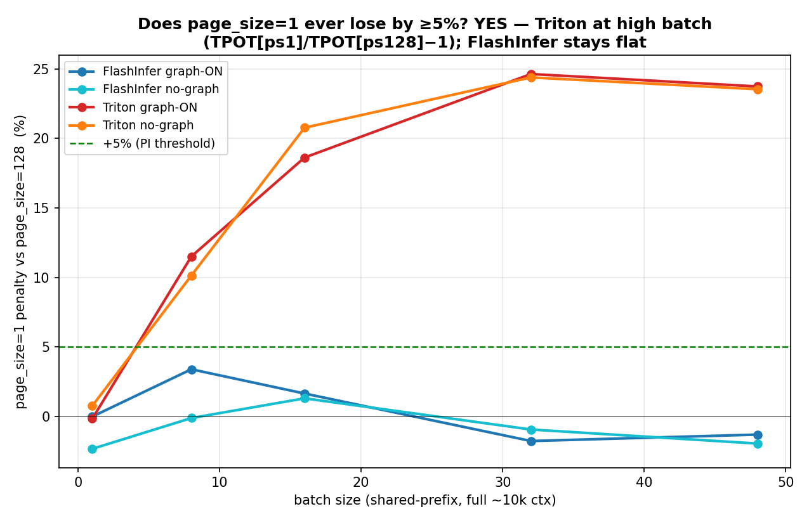
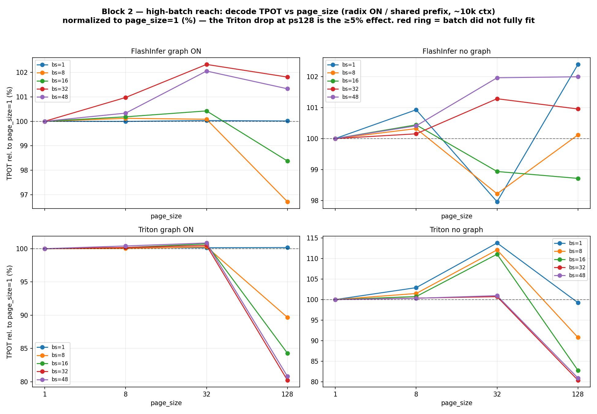
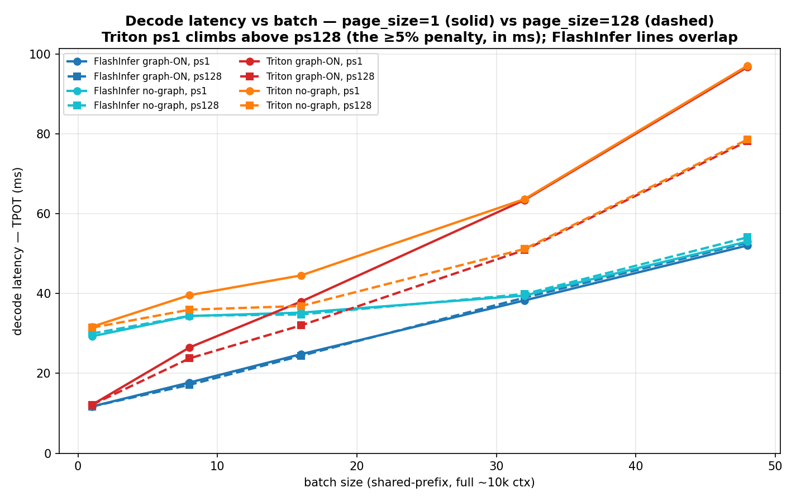
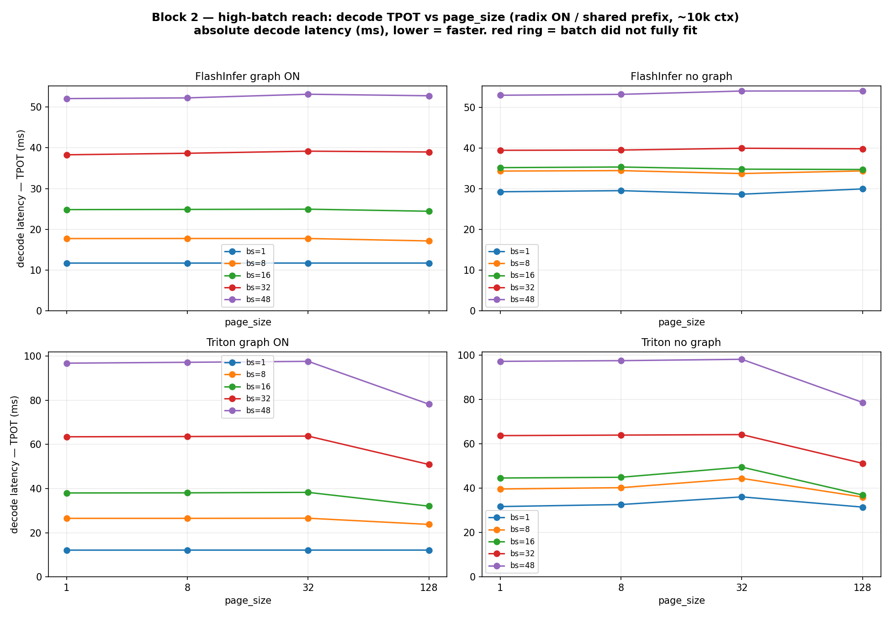
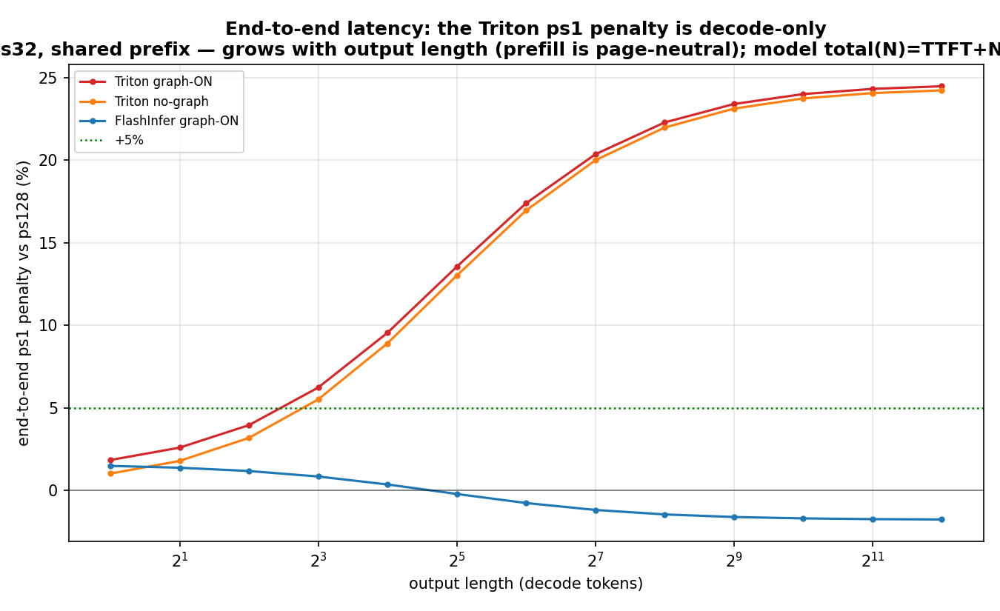
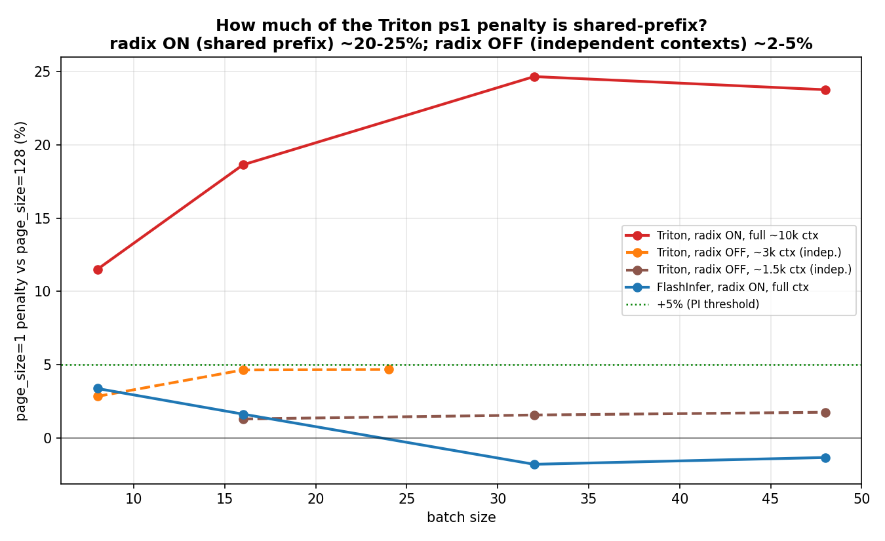
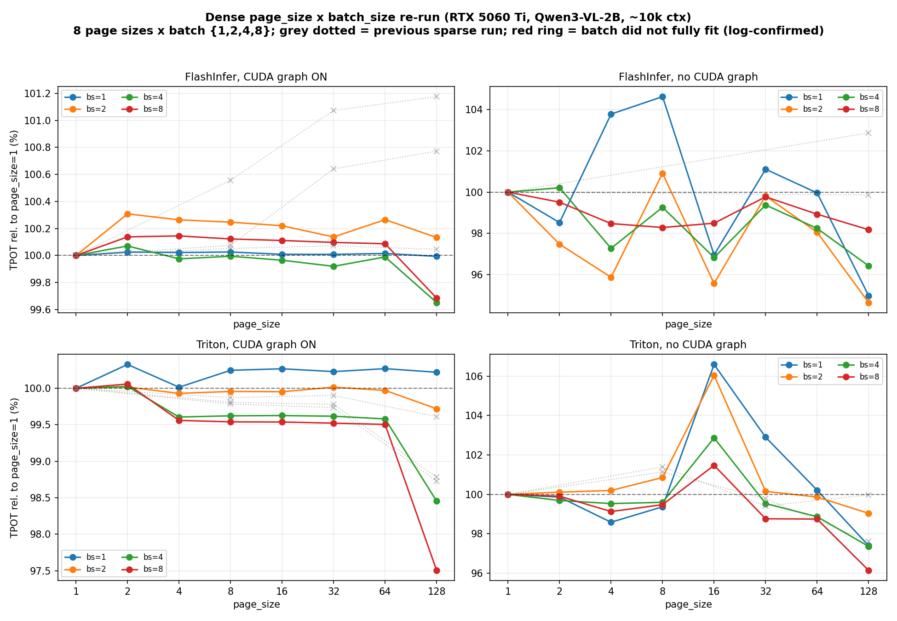
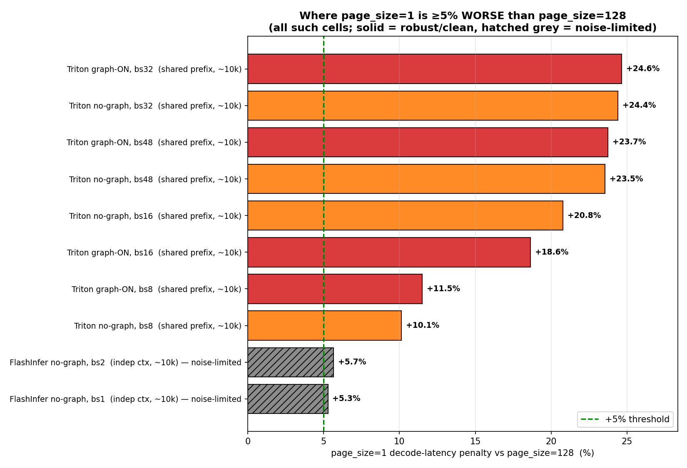
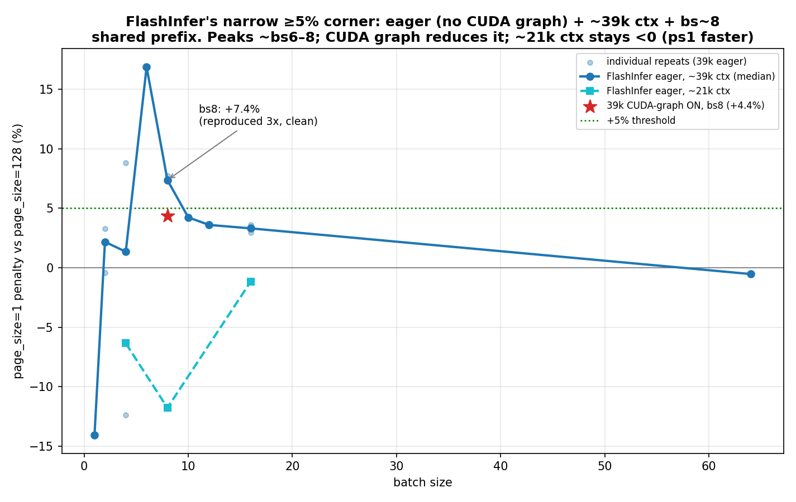

# Report 3 — Historical dense-sweep whole-call observation

> **Supersession notice (2026-07-17; reports 14–16).** This report is retained as the historical record of
> the original whole-call measurements, not as the current mechanism. Report 15 recovered per-step decode
> from the same gray logs: the shared-prefix Triton cells were **steady page-flat
> (ps1-vs-ps128 −0.3/−0.5/−0.4/−1.2%)**, although the old summary metric reported +11–25%. The old metric
> charged a cold shared-prefix admission ramp to “TPOT”; therefore the claims below that the headline is a
> pure decode-kernel effect, that Triton pays an `O(ctx/page_size)` walk, or that scatter/coalescing explains
> it are **retracted**. The radix-off ~3–5% observations are retained but lack the same same-run per-step
> closure and must not be presented as a proven kernel cost. For the current synthesis, start with
> [report 15](../15-log-forensics-and-upper-bound/report.md) and
> [report 16](../16-trtllm-mha-xqa/report.md).
>
> The remainder is the original report text. Any unqualified claim that the +11–25% number is decode-only,
> a kernel penalty, or a page-table/coalescing mechanism is superseded by this notice.

**A denser, fit-honest re-measurement of the four SGLang decode configs. It reproduces the prior low-batch near-neutrality *and* finds a clean ≥5% (up to ~25%) `page_size=1` decode-latency penalty for the Triton backend at high batch.**

| | |
|---|---|
| **Run** | RTX 5060 Ti (16 GB, Blackwell sm120) on `gray.cis.upenn.edu`, 2026-06-18/19 |
| **Model / prompt** | Qwen3-VL-2B-Instruct, ~9.7k-token [published request sample](../../data/inputs/browser-request-samples/request_005_20260316_221014/request.json) (historically aliased as `html_request/long_ctx10k.json`) |
| **PI's question (Jiaheng Lu)** | Is there a scenario where `page_size=1` is **not** the lowest decode latency, by **≥5–10%** (a real effect, not noise)? |
| **Headline answer** | **Yes — Triton backend, high batch.** Shared-prefix: `page_size=1` is **+11% (bs8) → +20–25% (bs16–48)** slower than `page_size=128`. Independent contexts: **~3–5%**. **FlashInfer** is page-robust in common regimes (≤3.4%) but has a *narrow* ≥5% corner — **eager / no CUDA graph + ~39k ctx + bs~8 → +7.4%** (§C.8). |
| **Supersedes** | The "near-neutral / no ≥5%" conclusion of [02-low-batch-baseline.md](../02-low-batch-baseline/report.md) (correct for the low-batch / FlashInfer regimes it tested; it never reached high batch). |
| **Code / data** | harness [measure_batch_latency_offline.py](../../scripts/measure_batch_latency_offline.py) · figures [studies/kv-cache-page-size/scripts/make_dense_figures.py](../../scripts/make_dense_figures.py) · raw `studies/kv-cache-page-size/data/raw/dense_5060ti/` |

## TL;DR

1. **The ≥5% scenario exists and is Triton-specific.** Triton decode, shared prefix, high batch, ps1 vs ps128: **+11.5 / +18.6 / +24.6 / +23.7 %** (bs 8/16/32/48) graph-ON; **+10.1 / +20.8 / +24.4 / +23.6 %** no-graph. Clean (std <0.7 %), independently re-verified.
2. **Most of that magnitude is the shared prefix.** With independent per-sequence contexts (radix off) the penalty is **~3–5 %**. The 20–25 % is specific to shared-prefix serving (shared system prompts / cached documents) — common, but not universal.
3. **FlashInfer is page-robust in the common regimes** (graph-on, ≤10k: ≤3.4 %, often ps128 marginally slower) — but **not immune**: a narrow corner (**eager / no CUDA graph + ~39k ctx + bs~6–8 + shared prefix**) gives ps1 **+7.4 %** (reproduced 3×, §C.8). CUDA graph reduces it to ~4 %; an order of magnitude narrower and smaller than Triton's. Plus ps1 needs far more memory at long context (won't fit under CUDA graph at 39k where ps128 does).
4. **It is a decode-only effect.** Prefill (TTFT) is page-neutral (~0 %); the penalty carries into end-to-end latency in proportion to output length (≈+21 % at 128 tokens, →+24 % for long generations).
5. **Consistency:** graph-ON panels reproduce the prior run within <1.3 %. The lone divergence (FlashInfer no-graph at low batch) was an unstable 2-point measurement, now shown to be noise.

---

# A. Experiment

## A.1 Setup
All runs use one offline SGLang engine per (backend, graph-mode, page_size), driven by [measure_batch_latency_offline.py](../../scripts/measure_batch_latency_offline.py) on the RTX 5060 Ti. Required for sm120: `CUDA_HOME=/usr/local/cuda-12.8`. Backends: **FlashInfer** and **Triton**; CUDA graph **ON** and **OFF** → the four configs of the original 4-panel figure.

## A.2 The measurement grid

| block | radix cache | context | page_size | batch | purpose |
|---|---|---|---|---|---|
| **1 — dense 4-panel** | OFF (independent KV) | full ~10k | {1,2,4,8,16,32,64,128} | {1,2,4,8} | densify the original figure + consistency check; no-graph run **fwd & reverse** page order |
| **2 — high-batch reach** | ON (shared prefix) | full ~10k | {1,8,32,128} | {1,8,16,32,48} | reach high batch at full context (shared prefix makes it fit) → where the effect lives |
| **3 — confirmation** | OFF (independent KV) | ~3k / ~1.5k (truncated prompt) | {1,8,32,128} | {8,16,24,32,48} | does the high-batch effect survive **without** a shared prefix? |

**Honest fit ceiling:** at full ~10k, radix-OFF only ~9–10 sequences fit, so Block 1 stops at bs8 (the old figure's bs16 was a partial-fit artifact). Block 2 uses the shared prefix to reach bs48 at full context; Block 3 uses short prompts to reach high batch with independent KV.

## A.3 What "latency" means here
The metric is **TPOT** = decode time per output token, **prefill excluded**:
`TPOT = (total − TTFT) / (tokens − 1)`. Every figure plots `tpot_median_ms` (or its ratio). This equals the latency of the repo's original e2e `page-size-sweep`. We additionally analyze **TTFT** (prefill) and **total** (end-to-end) latency in §C.3, from the same recorded data.

## A.4 Rigor upgrades (validated on the first cell, re-checked by an independent verification pass)
1. **True concurrency from the log.** The JSON `concurrency_ok`/`max_running_req` fields are permanently `false`/`0` (the scheduler runs in a child process the in-parent tracker can't see). A shell redirect `> cell.log 2>&1` captures the scheduler's `Decode batch … #running-req: N` lines → fit verified from logs. **Result: all 64 Block-1/2 launches (272 sub-cells) ran fully concurrent; zero OOM.**
2. **Real CUDA-graph capture at high batch.** A 16 GB card auto-caps `cuda_graph_max_bs=8`, so bs>8 silently runs eager. We plumbed **`--cuda-graph-max-bs`** (e.g. 48); logs confirm `Capture cuda graph bs [1,2,4,8,12,16,24,32,40,48]`. The effect appears in both graph and eager → not a capture artifact.
3. **Clean measurement.** Each launch gates on the GPU being idle (free ≥ 15.5 GB stable ~2.5 min) and records free before/after; the no-graph configs run page order forward **and** reversed as a reproducibility check.

---

# B. Data

## B.1 Coverage & location
Raw per-cell JSON + sibling `.log` in `studies/kv-cache-page-size/data/raw/dense_5060ti/`: `{fi,tri}_{g,ng}_ps*[ _rev].json` (Block 1), `hb_*` (Block 2), `cf_*` (Block 3). Each JSON is keyed by batch size and records TPOT (median/mean/std/min/max), TTFT, decode_time, total_time, throughput, and per-batch free-memory.

## B.2 Validity
- **Fit:** every plotted cell is log-confirmed `#running-req == batch` (fully concurrent); no OOM in any log.
- **Consistency vs the prior run (normalized, rel-to-ps1):** FlashInfer graph-ON max |Δ| **1.08 %**; Triton graph-ON max |Δ| **1.27 %** — i.e. the deterministic panels reproduce. (FlashInfer no-graph differs — see §C.5.)
- **Cleanliness:** headline cells have std <0.7 % of median (e.g. Triton graph bs32 ps1 = 63.45 ms, std 0.05).

---

# C. Analysis & Results

## C.1 Headline — Triton at high batch crosses ≥5% (Block 2)

`page_size=1` decode-latency penalty vs `page_size=128` (independently recomputed):

| batch | Triton graph-ON | Triton no-graph | FlashInfer graph-ON | FlashInfer no-graph |
|---|---|---|---|---|
| 8  | **+11.5%** | **+10.1%** | +3.4% | −0.1% |
| 16 | **+18.6%** | **+20.8%** | +1.7% | +1.3% |
| 32 | **+24.6%** | **+24.4%** | −1.8% | −0.9% |
| 48 | **+23.7%** | **+23.6%** | −1.3% | −2.0% |

**Presented two ways** (same data, same cells):

*Normalized (answers "is it ≥5%?"):*
| batch-trend | per-page-size |
|---|---|
|  |  |
| ps1 penalty vs batch, +5% line; Triton crosses by bs8, FlashInfer never. | TPOT rel. to ps1 per page_size; Triton drops at ps128, FlashInfer flat. |

*Absolute latency (answers "how many ms?"):*
| batch-trend | per-page-size |
|---|---|
|  |  |
| TPOT (ms) vs batch; ps1 solid vs ps128 dashed — Triton gap = ~13 ms (bs32) / ~19 ms (bs48). | TPOT (ms) per page_size; Triton ps128 sits ~12–19 ms below ps1 at high batch. |

## C.2 Which page actually wins (a nuance)
**ps128 is the fastest page in every Triton high-batch cell; ps1 is second; ps32 is the *slowest*.** For graph-ON the ps1/ps8/ps32 trio is within ~1% (reads as "flat, then a drop at ps128"). For no-graph there is a clear **ps32 hump** at moderate batch (bs8: ps1=39.6, ps8=40.2, **ps32=44.4**, ps128=36.0 ms — ps1 is ~10% *faster* than ps32), converging by bs32. So the ≥5% claim is always **ps1 vs the best page (ps128)**; `page_size=1` is *not the lowest*, but it is *not the worst* either.

## C.3 Decode vs prefill vs end-to-end latency
The same page-size effect across the three latency components (Triton, high batch):

| metric | bs16 | bs32 | bs48 |
|---|---|---|---|
| **TPOT (decode/token)** | +18–21% | **+24%** | +24% |
| **TTFT (prefill)** | ~0% | ~0% | ~0% |
| **end-to-end (128-tok request)** | +14–17% | +21% | +21% |

**The penalty is a pure decode-kernel effect — prefill is page-neutral** (prefill reads long contiguous chunks; only decode does the scattered per-token gather). Since prefill is fixed and page-neutral, the end-to-end penalty **grows with output length**:



Modelled as `total(N) = TTFT + N·TPOT`: e2e ps1 penalty rises from ~1% (1-token reply) → crosses +5% by ~8 output tokens → approaches ~24% for long generations. For realistic agentic/chat outputs the decode penalty essentially *is* the end-to-end penalty.

## C.4 How much is the shared prefix? — radix-OFF confirmation (Block 3)
Re-running Triton at high batch with radix cache **off** and short prompts (each sequence holds its own KV — verified: at bs8, `#token = 24016` = 8 × 3000 *distinct* tokens):



| regime | Triton graph-ON, ps1 penalty vs ps128 |
|---|---|
| **radix ON, shared prefix, full ~10k** | +11.5% (bs8), +18.6% (bs16), **+24.6%** (bs32), +23.7% (bs48) |
| **radix OFF, independent, ~3k** | +2.9% (bs8), **+4.7%** (bs16/24) |
| **radix OFF, independent, ~1.5k** | +1.3–1.8% |

**The dramatic 20–25% is largely a shared-prefix effect**; with independent contexts it is **~3–5%** (brushes 5% at ~3k ctx / bs≥16, grows with context and batch). Full-context high-batch radix-OFF doesn't fit in 16 GB, so its magnitude is bounded, not measured.

## C.5 Low batch & consistency with the prior run (Block 1)


*8 page sizes × batch {1,2,4,8}; grey dotted = previous sparse run; red ring = a batch that did not fully fit (none).* 
- **Graph-ON (both backends): near-neutral and reproducible** — within ~1–3% of ps1, std≈0, matching the prior run (<1.3%). This is V2's low-batch result, on a denser grid.
- **FlashInfer no-graph: noisy; the prior 2-point panel was unstable.** Fwd vs reverse disagree ~10% at bs1 and the sign flips → the old "+2.9% ps1-lowest" was noise, **not** claimed as a result.
- **Triton no-graph (radix-OFF, bs≤8): the same-sign seed** of the high-batch effect (grows to ~+4% at bs8).

## C.6 Mechanism
Triton's decode `_fwd_kernel` (`…/triton_ops/decode_attention.py`) gathers KV via a **per-token indirect index** (`kv_loc = tl.load(kv_indices + …)`, `BLOCK_N=64`). Large `page_size` → long contiguous physical KV runs → **coalesced** reads; `page_size=1` scatters every token. At high batch decode is memory-bandwidth-bound, so the coalescing penalty becomes first-order. A shared prefix shrinks the KV footprint, so decode is dominated by access *pattern* not raw volume → the ps1 scatter penalty is amplified (hence 20–25% shared-prefix vs ~3–5% independent). FlashInfer's fused paged kernel is page-size-agnostic → flat.

## C.7 Every cell where `page_size=1` is ≥5% worse


10 cells total: **8 robust** (Triton, both graph modes, shared prefix, bs8–48, +10% to +24.6%) and **2 noise-limited** (FlashInfer no-graph, independent ctx, bs1/bs2, +5.3/+5.7% — within run-to-run noise; hatched). *(These are from the main 10k grid; the FlashInfer long-context corner of §C.8 is separate.)*

## C.8 FlashInfer's narrow ≥5% corner (the PI's follow-up)

The PI also wanted a scenario where **FlashInfer** — not just Triton — mishandles page size. Reading the source: FlashInfer's decode kernel is page-agnostic and avoids padded-tail over-read, so its *only* page-size-dependent cost is the per-step **`begin_forward()`/plan**, which builds a page table of size `batch × ctx/page_size` (**128× larger at ps1**). **CUDA graph captures it once; eager mode re-runs it every step.** So the only place it can bite is **eager + many pages**.

Sweeping FlashInfer eager + shared prefix across context 10k→58k and batch 1→256 (high-repeat), there is a **narrow ≥5% corner**:



| FlashInfer eager, ~39k ctx, ps1 penalty vs ps128 | bs1 | bs2–4 | **bs6–8** | bs10–12 | bs16 | bs64 |
|---|---|---|---|---|---|---|
| | −14% | noisy ~0–3% | **+7.4%** (bs8, *3× reproduced*: +7.3/+7.4/+7.7, std ~0.4) | +3.6–4.2% | +3.3% | −0.5% |

- **Eager-specific:** CUDA graph at the same point gives **+4.4%** (ps128-graph ≈ ps128-eager) — the per-step plan accounts for the difference; the clean ≥5% needs eager.
- **Needs long context:** at **~21k it flips to ps1 *faster*** (−12%); the plan only dominates once there are enough pages (~39k+).
- **Narrow batch window:** peaks ~bs6–8, <5% by bs10–12, negative at bs1 and bs64 — unlike Triton's broad bs8–48.
- **Bonus memory penalty:** at 39k **with** CUDA graph, ps1 **wouldn't even fit** — the graph's page-index buffer is 128× bigger, shrinking the KV pool below the prompt length (*"Input length 39561 exceeds maximum 4700"*), while ps128 fit fine (38 ms). So tiny pages also carry a long-context **memory** cost.

**Verdict:** FlashInfer is **far more page-robust than Triton** (10–25% broadly), but **not immune** — eager + very long context + moderate batch costs ~7%, plus a memory penalty for tiny pages.

---

# D. Conclusion — answering the PI

**Yes — `page_size=1` is not the lowest decode latency by ≥5%, for the Triton backend at high batch.** Regime-dependent:
- **Shared prefix (common in serving): unambiguously ≥5%** — +11% (bs8) → +20–25% (bs16–48). Decode-only, present with and without CUDA graphs, carries into end-to-end latency for non-trivial output lengths.
- **Independent contexts: ~3–5%** (borderline; grows with context and batch).

**FlashInfer is page-robust but not immune:** it stays ≤3.4% across the common regimes, yet in a narrow corner (eager / no CUDA graph + ~39k ctx + bs~6–8) ps1 costs ~+7.4%, plus a memory penalty for tiny pages at long context (§C.8). **Practical guidance flips by backend: on Triton, prefer a large `page_size` (≈128) at scale, especially with shared prefixes; on FlashInfer, page size barely affects decode latency except in eager mode at very long context.** This substantiates the PI's "vLLM 有影响" intuition — a real kernel-level block_size effect: large and broad for Triton (paged gather under bandwidth pressure), small and narrow for FlashInfer (eager per-step plan over many pages).

---

# E. Limitations
- **Shared-prefix dependence** (§C.4): the headline 20–25% needs a shared prefix; independent contexts give ~3–5%. Full-context high-batch radix-OFF is untestable in 16 GB.
- **One GPU / one model.** The highest *independent-context* batch that fits at full 10k is 8 (Block 3 used shorter prompts, which dampens the effect).
- **FlashInfer no-graph low-batch "small-page penalty" is noise-limited** (§C.5) — direction-only, not a ≥5% result.
- **TPOT excludes prefill;** TTFT/e2e are analyzed in §C.3. JSON `concurrency_ok`/`max_running_req` are unreliable — all fit claims come from logs.

# F. Reproducibility

The maintained command below uses the retained request sample. The original remote run referred to the
same workload through the machine-local alias `html_request/long_ctx10k.json`.

```bash
export CUDA_HOME=/usr/local/cuda-12.8; export PATH=/usr/local/cuda-12.8/bin:$PATH
PY=~/venvs/bench_sglang/bin/python
# headline Triton high-batch cell (radix ON lets bs32 fit at full ctx):
$PY studies/kv-cache-page-size/scripts/measure_batch_latency_offline.py \
  studies/kv-cache-page-size/data/inputs/browser-request-samples/request_005_20260316_221014/request.json \
  --model-path ~/hf_models/Qwen3-VL-2B-Instruct --attention-backend triton \
  --batch-sizes 1 8 16 32 48 --max-tokens 128 --repeat 5 --page-size 1 \
  --enable-cuda-graph --cuda-graph-max-bs 48 --mem-fraction-static 0.85 \
  --context-length 12288 --output hb_tri_g_ps1.json > hb_tri_g_ps1.log 2>&1
# repeat with --page-size 128; compare tpot_median_ms; confirm fit from the log:
grep -E "Batch Size:|#running-req:" hb_tri_g_ps1.log
python3 studies/kv-cache-page-size/scripts/make_dense_figures.py   # regenerates all figures + dense_consistency.md
```

# G. Figure index

| figure | shows | x-axis | y-axis | §ref |
|---|---|---|---|---|
| [fig_dense_penalty.png](fig_dense_penalty.png) | the ≥5% answer | batch | **ps1-vs-ps128 penalty (%)** + 5% line | C.1 |
| [fig_dense_penalty_ms.png](fig_dense_penalty_ms.png) | same, absolute | batch | **decode latency (ms)**, ps1 solid / ps128 dashed | C.1 |
| [fig_dense_highbatch.png](fig_dense_highbatch.png) | page profile, 4 configs | page_size | **TPOT rel. to ps1 (%)** | C.1/C.2 |
| [fig_dense_highbatch_ms.png](fig_dense_highbatch_ms.png) | same, absolute | page_size | **decode latency (ms)** | C.1/C.2 |
| [fig_dense_highbatch_abs.png](fig_dense_highbatch_abs.png) | Triton vs FlashInfer ps1/ps128 | batch | decode latency (ms) | C.1 (alt) |
| [fig_dense_latency_decomp.png](fig_dense_latency_decomp.png) | e2e penalty grows w/ output length | output tokens | end-to-end penalty (%) | C.3 |
| [fig_dense_confirm.png](fig_dense_confirm.png) | shared-prefix vs independent | batch | ps1 penalty (%) | C.4 |
| [fig_dense_flashinfer.png](fig_dense_flashinfer.png) | FlashInfer's narrow ≥5% corner (eager+long-ctx) | batch | ps1 penalty (%) | C.8 |
| [fig_dense_4panel.png](fig_dense_4panel.png) | low-batch dense + consistency | page_size | TPOT rel. to ps1 (%) | C.5 |
| [fig_dense_over5.png](fig_dense_over5.png) | every ≥5% cell | penalty (%) | cells | C.7 |

Sources: [PagedAttention paper (arXiv 2309.06180)](https://arxiv.org/pdf/2309.06180) · prior study [02-low-batch-baseline.md](../02-low-batch-baseline/report.md) · kernel-level study [01-kernel-microbenchmark.md](../01-kernel-microbenchmark/report.md)
